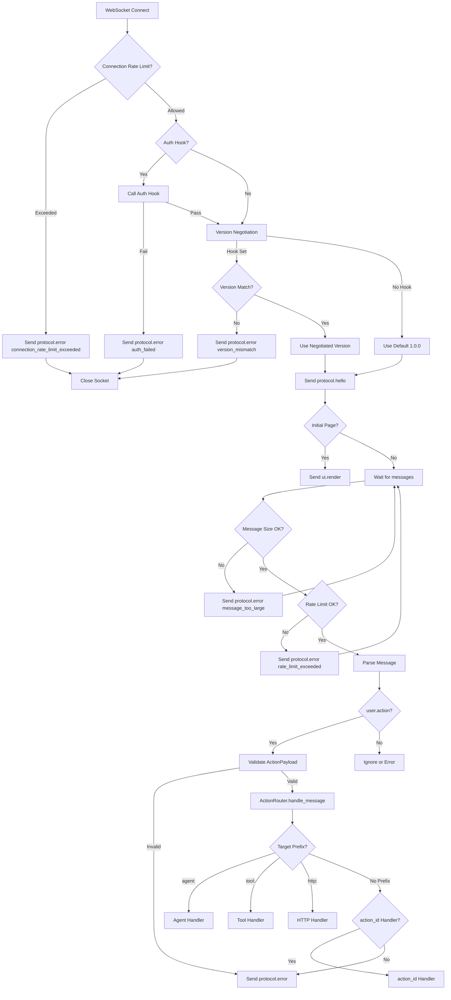
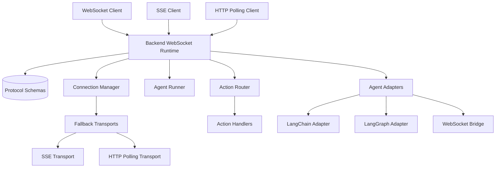

# Backend WebSocket Runtime

## Summary
Defines a FastAPI WebSocket endpoint at `/ws` that accepts connections, performs authenticated handshake with optional auth hook, negotiates protocol version, emits a `protocol.hello` message (and optionally an initial `ui.render` payload), then parses incoming messages to route `user.action` payloads to registered handlers. [agentprinter-fastapi/src/agentprinter_fastapi/router.py:L57-L160](agentprinter-fastapi/src/agentprinter_fastapi/router.py#L57-L160)
Provides a connection manager for tracking active WebSocket clients and broadcasting JSON payloads to them, with automatic fan-out to SSE and HTTP polling fallback transports. [agentprinter-fastapi/src/agentprinter_fastapi/manager.py:L7-L52](agentprinter-fastapi/src/agentprinter_fastapi/manager.py#L7-L52)
Enforces backpressure controls for inbound messages (size limits, per-connection rate limits) and coalesces rapid `ui.patch`/`state.patch` messages before broadcast. [agentprinter-fastapi/src/agentprinter_fastapi/router.py:L68-L189](agentprinter-fastapi/src/agentprinter_fastapi/router.py#L68-L189), [agentprinter-fastapi/src/agentprinter_fastapi/manager.py:L24-L110](agentprinter-fastapi/src/agentprinter_fastapi/manager.py#L24-L110)
Provides SSE endpoint at `/sse` for Server-Sent Events streaming as WebSocket fallback, reusing same message envelope and auth hooks. [agentprinter-fastapi/src/agentprinter_fastapi/router.py:L188-L291](agentprinter-fastapi/src/agentprinter_fastapi/router.py#L188-L291)
Provides HTTP polling endpoint at `/poll/{session_id}` with cursor-based message retrieval for clients without WebSocket or SSE support. [agentprinter-fastapi/src/agentprinter_fastapi/transports.py:L57-L68](agentprinter-fastapi/src/agentprinter_fastapi/transports.py#L57-L68)
Streams agent lifecycle events as `agent.event` messages over WebSockets, including error events on exceptions. [agentprinter-fastapi/src/agentprinter_fastapi/agent.py:L9-L44](agentprinter-fastapi/src/agentprinter_fastapi/agent.py#L9-L44)
Provides optional LangChain and LangGraph adapters for streaming real agent executions with event callbacks and execution history tracking. [agentprinter-fastapi/src/agentprinter_fastapi/agent_adapters.py:L1-L313](agentprinter-fastapi/src/agentprinter_fastapi/agent_adapters.py#L1-L313)

## Where to Start in Code
Fast entry points for future readers (no speculation; evidence-backed):
- **Primary entrypoint(s)**: [agentprinter-fastapi/src/agentprinter_fastapi/router.py:L57-L155](agentprinter-fastapi/src/agentprinter_fastapi/router.py#L57-L155)
- **Key orchestrator/service**: [agentprinter-fastapi/src/agentprinter_fastapi/actions.py:L7-L53](agentprinter-fastapi/src/agentprinter_fastapi/actions.py#L7-L53)
- **Data layer / schema** (if applicable): [agentprinter-fastapi/src/agentprinter_fastapi/schemas/protocol.py:L19-L34](agentprinter-fastapi/src/agentprinter_fastapi/schemas/protocol.py#L19-L34), [agentprinter-fastapi/src/agentprinter_fastapi/schemas/ui.py:L28-L43](agentprinter-fastapi/src/agentprinter_fastapi/schemas/ui.py#L28-L43)

## Users & Triggers
- WebSocket clients connect to `/ws` to initiate a session. [agentprinter-fastapi/src/agentprinter_fastapi/router.py:L57-L59](agentprinter-fastapi/src/agentprinter_fastapi/router.py#L57-L59)
- Server code can set an initial page or template loader, which triggers a `ui.render` message on connect. [agentprinter-fastapi/src/agentprinter_fastapi/router.py:L43-L55](agentprinter-fastapi/src/agentprinter_fastapi/router.py#L43-L55), [agentprinter-fastapi/src/agentprinter_fastapi/router.py:L90-L103](agentprinter-fastapi/src/agentprinter_fastapi/router.py#L90-L103)
- Clients send `user.action` messages, which are routed to action handlers. [agentprinter-fastapi/src/agentprinter_fastapi/router.py:L105-L141](agentprinter-fastapi/src/agentprinter_fastapi/router.py#L105-L141)

## What Happens
- The endpoint accepts the WebSocket, calls auth hook if configured (returns `protocol.error` with `code: auth_failed` and closes on failure), negotiates protocol version if hook is configured (returns `protocol.error` with `code: version_mismatch` and closes on mismatch), generates a trace ID, and sends a `protocol.hello` message with negotiated version. [agentprinter-fastapi/src/agentprinter_fastapi/router.py:L57-L108](agentprinter-fastapi/src/agentprinter_fastapi/router.py#L57-L108)
- If identity fields (`app_id`, `session_id`) are provided in the connection context, they are included in outbound message headers. [agentprinter-fastapi/src/agentprinter_fastapi/schemas/protocol.py:L24-L27](agentprinter-fastapi/src/agentprinter_fastapi/schemas/protocol.py#L24-L27)
- Incoming text messages are validated into a `Message` envelope and routed to the action router when `type` is `user.action`. [agentprinter-fastapi/src/agentprinter_fastapi/router.py:L105-L115](agentprinter-fastapi/src/agentprinter_fastapi/router.py#L105-L115)

## Rules & Constraints
- Auth hook is optional; if set and returns `False`, connection is rejected with `protocol.error` (`auth_failed`) and socket closes. [agentprinter-fastapi/src/agentprinter_fastapi/router.py:L61-L72](agentprinter-fastapi/src/agentprinter_fastapi/router.py#L61-L72)
- Version negotiation hook is optional; if set and client version doesn't match, connection is rejected with `protocol.error` (`version_mismatch`) and socket closes. [agentprinter-fastapi/src/agentprinter_fastapi/router.py:L74-L95](agentprinter-fastapi/src/agentprinter_fastapi/router.py#L74-L95)
- Default protocol version is `1.0.0` if no negotiation hook is set. [agentprinter-fastapi/src/agentprinter_fastapi/router.py:L76](agentprinter-fastapi/src/agentprinter_fastapi/router.py#L76)
- Only `user.action` messages are routed; other message types are ignored. [agentprinter-fastapi/src/agentprinter_fastapi/actions.py:L42-L44](agentprinter-fastapi/src/agentprinter_fastapi/actions.py#L42-L44)
- Action routing supports two modes: target-based (by target prefix like `agent:`, `tool:`, `http:`) and action_id-based (by registered `action_id`). Target-based routing takes precedence if a target handler is registered. [agentprinter-fastapi/src/agentprinter_fastapi/actions.py:L61-L75](agentprinter-fastapi/src/agentprinter_fastapi/actions.py#L61-L75)
- `user.action` payloads are validated against `ActionPayload`; invalid payloads return `protocol.error` with `code: invalid_action_payload`. [agentprinter-fastapi/src/agentprinter_fastapi/actions.py:L45-L59](agentprinter-fastapi/src/agentprinter_fastapi/actions.py#L45-L59), [agentprinter-fastapi/src/agentprinter_fastapi/router.py:L112-L123](agentprinter-fastapi/src/agentprinter_fastapi/router.py#L112-L123)
- If a max message size is configured, oversized inbound messages return `protocol.error` with `code: message_too_large`. [agentprinter-fastapi/src/agentprinter_fastapi/router.py:L169-L177](agentprinter-fastapi/src/agentprinter_fastapi/router.py#L169-L177)
- Inbound messages over the configured rate limit return `protocol.error` with `code: rate_limit_exceeded`. [agentprinter-fastapi/src/agentprinter_fastapi/router.py:L180-L188](agentprinter-fastapi/src/agentprinter_fastapi/router.py#L180-L188)
- If connection rate limiting is enabled, excess connection attempts return `protocol.error` with `code: connection_rate_limit_exceeded` and close the socket. [agentprinter-fastapi/src/agentprinter_fastapi/router.py:L77-L92](agentprinter-fastapi/src/agentprinter_fastapi/router.py#L77-L92)
- Unknown action IDs raise a `KeyError` and are surfaced to clients as structured `protocol.error` messages. [agentprinter-fastapi/src/agentprinter_fastapi/router.py:L124-L131](agentprinter-fastapi/src/agentprinter_fastapi/router.py#L124-L131), [agentprinter-fastapi/src/agentprinter_fastapi/schemas/protocol.py:L6-L10](agentprinter-fastapi/src/agentprinter_fastapi/schemas/protocol.py#L6-L10)
- Invalid message envelopes trigger `protocol.error` with `code: invalid_message`. [agentprinter-fastapi/src/agentprinter_fastapi/router.py:L142-L150](agentprinter-fastapi/src/agentprinter_fastapi/router.py#L142-L150)

## Edge Cases & Failure Outcomes
- Auth failure returns `protocol.error` with `code: auth_failed` and closes socket. [agentprinter-fastapi/src/agentprinter_fastapi/router.py:L61-L72](agentprinter-fastapi/src/agentprinter_fastapi/router.py#L61-L72)
- Version mismatch returns `protocol.error` with `code: version_mismatch` and closes socket. [agentprinter-fastapi/src/agentprinter_fastapi/router.py:L74-L95](agentprinter-fastapi/src/agentprinter_fastapi/router.py#L74-L95)
- Invalid `user.action` payloads return `protocol.error` with `code: invalid_action_payload`. [agentprinter-fastapi/src/agentprinter_fastapi/router.py:L132-L143](agentprinter-fastapi/src/agentprinter_fastapi/router.py#L132-L143)
- Unknown action ID results in a `protocol.error` response with `code: unknown_action`. [agentprinter-fastapi/src/agentprinter_fastapi/router.py:L124-L131](agentprinter-fastapi/src/agentprinter_fastapi/router.py#L124-L131)
- Exceptions in a handler are logged and returned as structured `protocol.error` with `code: handler_error`. [agentprinter-fastapi/src/agentprinter_fastapi/router.py:L132-L140](agentprinter-fastapi/src/agentprinter_fastapi/router.py#L132-L140)
- Invalid JSON or envelopes return `protocol.error` with `code: invalid_message`. [agentprinter-fastapi/src/agentprinter_fastapi/router.py:L142-L150](agentprinter-fastapi/src/agentprinter_fastapi/router.py#L142-L150)
- WebSocket disconnects remove the connection from the manager. [agentprinter-fastapi/src/agentprinter_fastapi/router.py:L152-L154](agentprinter-fastapi/src/agentprinter_fastapi/router.py#L152-L154)

## Use Cases
- **Use case**: Authenticated handshake with auth hook
  - **Trigger**: WebSocket connects to `/ws` with auth hook configured
  - **Outcome**: Auth hook is called with websocket scope; if auth fails, `protocol.error` with `code: auth_failed` is sent and socket closes
  - **Evidence**: [agentprinter-fastapi/src/agentprinter_fastapi/router.py:L61-L72](agentprinter-fastapi/src/agentprinter_fastapi/router.py#L61-L72), [agentprinter-fastapi/tests/test_router.py:L69-L89](agentprinter-fastapi/tests/test_router.py#L69-L89)
- **Use case**: Protocol version negotiation
  - **Trigger**: WebSocket connects to `/ws?version=X.Y.Z` with version negotiation hook configured
  - **Outcome**: Server negotiates version; if mismatch, `protocol.error` with `code: version_mismatch` is sent and socket closes; if successful, `protocol.hello` includes negotiated version
  - **Evidence**: [agentprinter-fastapi/src/agentprinter_fastapi/router.py:L74-L95](agentprinter-fastapi/src/agentprinter_fastapi/router.py#L74-L95), [agentprinter-fastapi/tests/test_router.py:L91-L130](agentprinter-fastapi/tests/test_router.py#L91-L130)
- **Use case**: Client connects and receives `protocol.hello`
  - **Trigger**: WebSocket connects to `/ws`
  - **Outcome**: Client receives a hello envelope with trace ID and protocol version
  - **Evidence**: [agentprinter-fastapi/src/agentprinter_fastapi/router.py:L97-L108](agentprinter-fastapi/src/agentprinter_fastapi/router.py#L97-L108), [agentprinter-fastapi/tests/test_router.py:L20-L26](agentprinter-fastapi/tests/test_router.py#L20-L26)
- **Use case**: Connection rate limit rejects excess connection attempts
  - **Trigger**: Connection attempts exceed the configured rate limit
  - **Outcome**: Server sends `protocol.error` (`connection_rate_limit_exceeded`) and closes the socket
  - **Evidence**: [agentprinter-fastapi/src/agentprinter_fastapi/router.py:L77-L92](agentprinter-fastapi/src/agentprinter_fastapi/router.py#L77-L92), [agentprinter-fastapi/tests/test_backpressure_rate_limits.py:L103-L124](agentprinter-fastapi/tests/test_backpressure_rate_limits.py#L103-L124)
- **Use case**: Message size limit rejects oversized inbound messages
  - **Trigger**: Client sends a message exceeding the configured size limit
  - **Outcome**: Server responds with `protocol.error` (`message_too_large`) and skips processing
  - **Evidence**: [agentprinter-fastapi/src/agentprinter_fastapi/router.py:L169-L177](agentprinter-fastapi/src/agentprinter_fastapi/router.py#L169-L177), [agentprinter-fastapi/tests/test_backpressure_rate_limits.py:L27-L60](agentprinter-fastapi/tests/test_backpressure_rate_limits.py#L27-L60)
- **Use case**: Inbound rate limiting rejects excess messages
  - **Trigger**: Client sends messages faster than the configured rate
  - **Outcome**: Server responds with `protocol.error` (`rate_limit_exceeded`) and skips processing
  - **Evidence**: [agentprinter-fastapi/src/agentprinter_fastapi/router.py:L180-L188](agentprinter-fastapi/src/agentprinter_fastapi/router.py#L180-L188), [agentprinter-fastapi/src/agentprinter_fastapi/backpressure.py:L10-L57](agentprinter-fastapi/src/agentprinter_fastapi/backpressure.py#L10-L57), [agentprinter-fastapi/tests/test_backpressure_rate_limits.py:L63-L100](agentprinter-fastapi/tests/test_backpressure_rate_limits.py#L63-L100)
- **Use case**: Patch coalescing merges rapid ui.patch/state.patch broadcasts
  - **Trigger**: Multiple `ui.patch` or `state.patch` messages are broadcast in quick succession
  - **Outcome**: Manager batches patches within the coalesce window and sends one combined payload
  - **Evidence**: [agentprinter-fastapi/src/agentprinter_fastapi/manager.py:L24-L44](agentprinter-fastapi/src/agentprinter_fastapi/manager.py#L24-L44), [agentprinter-fastapi/src/agentprinter_fastapi/manager.py:L91-L110](agentprinter-fastapi/src/agentprinter_fastapi/manager.py#L91-L110), [agentprinter-fastapi/tests/test_backpressure_rate_limits.py:L127-L164](agentprinter-fastapi/tests/test_backpressure_rate_limits.py#L127-L164)
- **Use case**: Transmit session identity in message headers
  - **Trigger**: Server or client associates session info with the connection
  - **Outcome**: Outbound messages include `session_id` and `app_id` in the header
  - **Evidence**: [agentprinter-fastapi/src/agentprinter_fastapi/schemas/protocol.py:L24-L27](agentprinter-fastapi/src/agentprinter_fastapi/schemas/protocol.py#L24-L27)
- **Use case**: Return structured error for unknown action
  - **Trigger**: Client sends a `user.action` with an unregistered `action_id`
  - **Outcome**: Client receives `protocol.error` with structured `ErrorPayload`
  - **Evidence**: [agentprinter-fastapi/src/agentprinter_fastapi/router.py:L124-L131](agentprinter-fastapi/src/agentprinter_fastapi/router.py#L124-L131), [agentprinter-fastapi/src/agentprinter_fastapi/schemas/protocol.py:L6-L10](agentprinter-fastapi/src/agentprinter_fastapi/schemas/protocol.py#L6-L10)
- **Use case**: Action handler executes for `user.action` (action_id-based routing)
  - **Trigger**: Client sends a `user.action` message with a registered `action_id`
  - **Outcome**: Payload is validated as `ActionPayload`, then the registered handler is called with the message and websocket
  - **Evidence**: [agentprinter-fastapi/src/agentprinter_fastapi/actions.py:L32-L72](agentprinter-fastapi/src/agentprinter_fastapi/actions.py#L32-L72), [agentprinter-fastapi/tests/test_actions.py:L8-L42](agentprinter-fastapi/tests/test_actions.py#L8-L42)
- **Use case**: Action routes to agent handler by target prefix
  - **Trigger**: Client sends a `user.action` message with target starting with `agent:` (e.g., `agent:run_analysis`)
  - **Outcome**: Payload is validated, then the registered agent target handler is called
  - **Evidence**: [agentprinter-fastapi/src/agentprinter_fastapi/actions.py:L23-L30](agentprinter-fastapi/src/agentprinter_fastapi/actions.py#L23-L30), [agentprinter-fastapi/src/agentprinter_fastapi/actions.py:L61-L75](agentprinter-fastapi/src/agentprinter_fastapi/actions.py#L61-L75), [agentprinter-fastapi/tests/test_actions.py:L143-L165](agentprinter-fastapi/tests/test_actions.py#L143-L165)
- **Use case**: Action routes to tool handler by target prefix
  - **Trigger**: Client sends a `user.action` message with target starting with `tool:` (e.g., `tool:search`)
  - **Outcome**: Payload is validated, then the registered tool target handler is called
  - **Evidence**: [agentprinter-fastapi/src/agentprinter_fastapi/actions.py:L23-L30](agentprinter-fastapi/src/agentprinter_fastapi/actions.py#L23-L30), [agentprinter-fastapi/src/agentprinter_fastapi/actions.py:L61-L75](agentprinter-fastapi/src/agentprinter_fastapi/actions.py#L61-L75), [agentprinter-fastapi/tests/test_actions.py:L167-L189](agentprinter-fastapi/tests/test_actions.py#L167-L189)
- **Use case**: Action routes to HTTP handler by target prefix
  - **Trigger**: Client sends a `user.action` message with target starting with `http:` (e.g., `http:POST:/api/endpoint`)
  - **Outcome**: Payload is validated, then the registered HTTP target handler is called
  - **Evidence**: [agentprinter-fastapi/src/agentprinter_fastapi/actions.py:L23-L30](agentprinter-fastapi/src/agentprinter_fastapi/actions.py#L23-L30), [agentprinter-fastapi/src/agentprinter_fastapi/actions.py:L61-L75](agentprinter-fastapi/src/agentprinter_fastapi/actions.py#L61-L75), [agentprinter-fastapi/tests/test_actions.py:L191-L213](agentprinter-fastapi/tests/test_actions.py#L191-L213)
- **Use case**: Invalid `user.action` payload is rejected
  - **Trigger**: Client sends a `user.action` message whose payload fails `ActionPayload` validation (missing required fields / invalid enum)
  - **Outcome**: Client receives `protocol.error` with `code: invalid_action_payload`
  - **Evidence**: [agentprinter-fastapi/src/agentprinter_fastapi/router.py:L112-L123](agentprinter-fastapi/src/agentprinter_fastapi/router.py#L112-L123), [agentprinter-fastapi/tests/test_action_integration.py:L130-L176](agentprinter-fastapi/tests/test_action_integration.py#L130-L176)
- **Use case**: Agent events stream to the client
  - **Trigger**: An agent generator yields events
  - **Outcome**: `agent.event` messages are sent over the WebSocket
  - **Evidence**: [agentprinter-fastapi/src/agentprinter_fastapi/agent.py:L9-L33](agentprinter-fastapi/src/agentprinter_fastapi/agent.py#L9-L33), [agentprinter-fastapi/tests/test_agent.py:L8-L51](agentprinter-fastapi/tests/test_agent.py#L8-L51)
- **Use case**: LangChain adapter streams events with AgentEvent contract compliance
  - **Trigger**: Application uses `LangChainAgentAdapter` with `on_event` and `on_final` hooks
  - **Outcome**: Adapter emits events matching `AgentEvent.event` contract (`start`, `tool_call`, `tool_result`, `finish`, `error`) and calls `on_final` with final result
  - **Evidence**: [agentprinter-fastapi/src/agentprinter_fastapi/agent_adapters.py:L9-L84](agentprinter-fastapi/src/agentprinter_fastapi/agent_adapters.py#L9-L84), [agentprinter-fastapi/tests/test_agent_adapters.py:L190-L216](agentprinter-fastapi/tests/test_agent_adapters.py#L190-L216)
- **Use case**: LangGraph adapter streams events with AgentEvent contract compliance
  - **Trigger**: Application uses `LangGraphAgentAdapter` with `on_event` and `on_final` hooks
  - **Outcome**: Adapter emits events matching `AgentEvent.event` contract and calls `on_final` with final state
  - **Evidence**: [agentprinter-fastapi/src/agentprinter_fastapi/agent_adapters.py:L121-L214](agentprinter-fastapi/src/agentprinter_fastapi/agent_adapters.py#L121-L214), [agentprinter-fastapi/tests/test_agent_adapters.py:L218-L240](agentprinter-fastapi/tests/test_agent_adapters.py#L218-L240)
- **Use case**: LangChain adapter streams events with execution history tracking
  - **Trigger**: Application instantiates `LangChainAgentAdapter` and calls `run_agent()`
  - **Outcome**: Agent lifecycle events flow through `on_event` callback; history is tracked via `get_history()`
  - **Evidence**: [agentprinter-fastapi/src/agentprinter_fastapi/agent_adapters.py:L9-L73](agentprinter-fastapi/src/agentprinter_fastapi/agent_adapters.py#L9-L73), [agentprinter-fastapi/tests/test_real_agents.py:L40-L55](agentprinter-fastapi/tests/test_real_agents.py#L40-L55)
- **Use case**: LangGraph adapter streams node events with output capture
  - **Trigger**: Application instantiates `LangGraphAgentAdapter` and calls `run_graph()`
  - **Outcome**: Node events flow through `on_event` callback; node outputs captured in `node_outputs` dict; history tracked via `get_history()`
  - **Evidence**: [agentprinter-fastapi/src/agentprinter_fastapi/agent_adapters.py:L109-L183](agentprinter-fastapi/src/agentprinter_fastapi/agent_adapters.py#L109-L183), [agentprinter-fastapi/tests/test_real_agents.py:L89-L101](agentprinter-fastapi/tests/test_real_agents.py#L89-L101)
- **Use case**: WebSocket bridge converts agent events to UI patches with state management
  - **Trigger**: Application calls `bridge.on_agent_event()` with an agent event
  - **Outcome**: UI patches are emitted; state transitions (idle ↔ running ↔ error); output accumulated via `get_accumulated_output()` and `get_state()`
  - **Evidence**: [agentprinter-fastapi/src/agentprinter_fastapi/agent_adapters.py:L189-L313](agentprinter-fastapi/src/agentprinter_fastapi/agent_adapters.py#L189-L313), [agentprinter-fastapi/tests/test_real_agents.py:L58-L119](agentprinter-fastapi/tests/test_real_agents.py#L58-L119)
- **Use case**: Template loader sends `ui.render` on connect
  - **Trigger**: Template loader is configured via `set_template_loader()` or `set_template_directory()`
  - **Outcome**: On WebSocket connect, template is loaded, validated against `Page` schema, and sent as `ui.render` message
  - **Evidence**: [agentprinter-fastapi/src/agentprinter_fastapi/router.py:L118-L130](agentprinter-fastapi/src/agentprinter_fastapi/router.py#L118-L130), [agentprinter-fastapi/src/agentprinter_fastapi/templates.py:L7-L30](agentprinter-fastapi/src/agentprinter_fastapi/templates.py#L7-L30), [agentprinter-fastapi/tests/test_template_loader.py:L9-L43](agentprinter-fastapi/tests/test_template_loader.py#L9-L43)
- **Use case**: PageBuilder API creates Page objects programmatically
  - **Trigger**: Application uses `PageBuilder` to construct pages programmatically
  - **Outcome**: `PageBuilder` provides fluent API for building component trees and returns validated `Page` objects
  - **Evidence**: [agentprinter-fastapi/src/agentprinter_fastapi/templates.py:L57-L160](agentprinter-fastapi/src/agentprinter_fastapi/templates.py#L57-L160), [agentprinter-fastapi/tests/test_template_loader.py:L60-L73](agentprinter-fastapi/tests/test_template_loader.py#L60-L73)
- **Use case**: Template directory loader loads templates from filesystem
  - **Trigger**: Application calls `set_template_directory()` with directory path and template name
  - **Outcome**: Loader function is created that loads and validates template from filesystem on each connect
  - **Evidence**: [agentprinter-fastapi/src/agentprinter_fastapi/templates.py:L162-L175](agentprinter-fastapi/src/agentprinter_fastapi/templates.py#L162-L175), [agentprinter-fastapi/tests/test_template_loader.py:L75-L100](agentprinter-fastapi/tests/test_template_loader.py#L75-L100)
- **Use case**: All `protocol.error` payloads conform to the `ErrorPayload` contract
  - **Trigger**: Error occurs during WebSocket connection/handshake/routing (auth fail, unknown action, handler error, invalid message)
  - **Outcome**: `protocol.error` message sent with payload that validates against `ErrorPayload` (code: str, message: str, details: dict)
  - **Evidence**: [agentprinter-fastapi/src/agentprinter_fastapi/router.py:L14-L34](agentprinter-fastapi/src/agentprinter_fastapi/router.py#L14-L34) (make_protocol_error helper), [agentprinter-fastapi/src/agentprinter_fastapi/router.py:L61-L150](agentprinter-fastapi/src/agentprinter_fastapi/router.py#L61-L150) (error emissions)
- **Use case**: SSE endpoint streams protocol.hello and ui.render
  - **Trigger**: Client connects to `/sse` endpoint with Accept: text/event-stream header
  - **Outcome**: SSE stream sends `protocol.hello` message followed by `ui.render` (if template loader configured), reusing same auth hooks and version negotiation as WebSocket
  - **Evidence**: [agentprinter-fastapi/src/agentprinter_fastapi/router.py:L188-L291](agentprinter-fastapi/src/agentprinter_fastapi/router.py#L188-L291), [agentprinter-fastapi/tests/test_sse_fallback.py:L17-L33](agentprinter-fastapi/tests/test_sse_fallback.py#L17-L33)
- **Use case**: HTTP polling returns messages since cursor
  - **Trigger**: Client polls `/poll/{session_id}?cursor=N&limit=M` endpoint
  - **Outcome**: Returns messages queued for session since cursor position, with next cursor value for subsequent polls
  - **Evidence**: [agentprinter-fastapi/src/agentprinter_fastapi/transports.py:L32-L68](agentprinter-fastapi/src/agentprinter_fastapi/transports.py#L32-L68), [agentprinter-fastapi/tests/test_sse_fallback.py:L66-L101](agentprinter-fastapi/tests/test_sse_fallback.py#L66-L101)
- **Use case**: Connection manager fans out messages to fallback transports
  - **Trigger**: Message is broadcast via ConnectionManager.broadcast()
  - **Outcome**: Message is sent to WebSocket clients and also queued for HTTP polling and broadcast to SSE clients (if session_id present)
  - **Evidence**: [agentprinter-fastapi/src/agentprinter_fastapi/manager.py:L35-L52](agentprinter-fastapi/src/agentprinter_fastapi/manager.py#L35-L52)
- **Use case**: Client reconnects and requests replay via protocol.resume
  - **Trigger**: Client sends `protocol.resume` with `last_seen_seq`
  - **Outcome**: Backend fetches missed messages from HTTP polling queue and replays them to the socket
  - **Evidence**: [agentprinter-fastapi/src/agentprinter_fastapi/router.py:L226-L235](agentprinter-fastapi/src/agentprinter_fastapi/router.py#L226-L235)

## Scope Navigation
- **Parent**: [Product Scopes](../README.md)
- **Children**
  - None

## Scope Network (Cross-links)
Every relationship must include evidence, or be placed under "Possible Relations".

- **Depends on / Uses (Upstream)**
  - [Protocol Schema](../Contracts/Protocol_Schema.md) — protocol message shapes are defined as Pydantic models exported to schema. [agentprinter-fastapi/scripts/export_schema.py:L7-L41](agentprinter-fastapi/scripts/export_schema.py#L7-L41)
- **Used by / Downstream**
  - [Remote UI Runtime](../Frontend/Remote_UI_Runtime.md) — client components send `user.action` messages that this runtime routes. [agentprinter-react/src/renderer.tsx:L70-L88](agentprinter-react/src/renderer.tsx#L70-L88), [agentprinter-fastapi/src/agentprinter_fastapi/router.py:L112-L115](agentprinter-fastapi/src/agentprinter_fastapi/router.py#L112-L115)
  - [Demo Apps (Examples)](../Examples/Demo_Apps.md) — demo mounts the router and uses the `/ws` endpoint. [examples/backend_demo.py:L22-L23](examples/backend_demo.py#L22-L23), [examples/README.md:L45-L45](examples/README.md#L45-L45)
- **Shares Data / Topics**
  - [Remote UI Runtime](../Frontend/Remote_UI_Runtime.md) — uses the same `Message` envelope (`type`, `header`, `payload`). [agentprinter-fastapi/src/agentprinter_fastapi/schemas/protocol.py:L29-L34](agentprinter-fastapi/src/agentprinter_fastapi/schemas/protocol.py#L29-L34)

## Diagrams (Mermaid inline) — exactly 2

### Diagram 1: Core Flow with Auth, Version Negotiation & Errors

### Diagram 2: Ecosystem / Dependencies

## Usage & Flow Traces
Provide at least one end-to-end trace per major path.

| Step | Layer | Evidence Link | Description |
|------|-------|---------------|-------------|
| 1 | Entry | [agentprinter-fastapi/src/agentprinter_fastapi/router.py:L57-L59](agentprinter-fastapi/src/agentprinter_fastapi/router.py#L57-L59) | WebSocket connects to `/ws` endpoint |
| 1a | Guard | [agentprinter-fastapi/src/agentprinter_fastapi/router.py:L77-L92](agentprinter-fastapi/src/agentprinter_fastapi/router.py#L77-L92) | Connection rate limiter rejects excess connection attempts |
| 2 | Auth | [agentprinter-fastapi/src/agentprinter_fastapi/router.py:L61-L72](agentprinter-fastapi/src/agentprinter_fastapi/router.py#L61-L72) | Auth hook is called; if fails, `protocol.error` (`auth_failed`) sent and socket closes |
| 3 | Version | [agentprinter-fastapi/src/agentprinter_fastapi/router.py:L74-L95](agentprinter-fastapi/src/agentprinter_fastapi/router.py#L74-L95) | Version negotiation hook is called if set; if mismatch, `protocol.error` (`version_mismatch`) sent and socket closes |
| 4 | Hello | [agentprinter-fastapi/src/agentprinter_fastapi/router.py:L97-L108](agentprinter-fastapi/src/agentprinter_fastapi/router.py#L97-L108) | `protocol.hello` message sent with trace ID and negotiated version |
| 5 | Template | [agentprinter-fastapi/src/agentprinter_fastapi/router.py:L110-L130](agentprinter-fastapi/src/agentprinter_fastapi/router.py#L110-L130) | Template loader is called if configured; template is validated against `Page` schema and sent as `ui.render` |
| 6 | Entry | [agentprinter-fastapi/src/agentprinter_fastapi/router.py:L132-L134](agentprinter-fastapi/src/agentprinter_fastapi/router.py#L132-L134) | WebSocket receives a text message and parses to `Message` |
| 6a | Guard | [agentprinter-fastapi/src/agentprinter_fastapi/router.py:L169-L177](agentprinter-fastapi/src/agentprinter_fastapi/router.py#L169-L177) | Message size limit rejects oversized payloads with `protocol.error` |
| 6b | Guard | [agentprinter-fastapi/src/agentprinter_fastapi/router.py:L180-L188](agentprinter-fastapi/src/agentprinter_fastapi/router.py#L180-L188) | Rate limiter rejects excess inbound messages with `protocol.error` |
| 7 | Validation | [agentprinter-fastapi/src/agentprinter_fastapi/router.py:L137-L138](agentprinter-fastapi/src/agentprinter_fastapi/router.py#L137-L138) | Message envelope is validated |
| 8 | Logic | [agentprinter-fastapi/src/agentprinter_fastapi/router.py:L140-L143](agentprinter-fastapi/src/agentprinter_fastapi/router.py#L140-L143) | `user.action` messages are routed to the ActionRouter |
| 9 | Validation | [agentprinter-fastapi/src/agentprinter_fastapi/actions.py:L51-L59](agentprinter-fastapi/src/agentprinter_fastapi/actions.py#L51-L59) | Action payload is validated as `ActionPayload` |
| 10 | Output | [agentprinter-fastapi/src/agentprinter_fastapi/router.py:L144-L155](agentprinter-fastapi/src/agentprinter_fastapi/router.py#L144-L155) | Invalid action payload triggers `protocol.error` (`invalid_action_payload`) |
| 11 | Routing | [agentprinter-fastapi/src/agentprinter_fastapi/actions.py:L61-L75](agentprinter-fastapi/src/agentprinter_fastapi/actions.py#L61-L75) | Action router resolves handler by target prefix (agent/tool/http) or falls back to action_id |
| 12 | Data | [agentprinter-fastapi/src/agentprinter_fastapi/actions.py:L77-L82](agentprinter-fastapi/src/agentprinter_fastapi/actions.py#L77-L82) | Handler is invoked with message and websocket |
| 13 | Output | [agentprinter-fastapi/src/agentprinter_fastapi/router.py:L156-L163](agentprinter-fastapi/src/agentprinter_fastapi/router.py#L156-L163) | Unknown action triggers `protocol.error` (`unknown_action`) |
| 14 | Fan-out | [agentprinter-fastapi/src/agentprinter_fastapi/manager.py:L35-L52](agentprinter-fastapi/src/agentprinter_fastapi/manager.py#L35-L52) | Broadcast message is fanned out to WebSocket clients, SSE clients, and HTTP polling queue |
| 14a | Backpressure | [agentprinter-fastapi/src/agentprinter_fastapi/manager.py:L91-L110](agentprinter-fastapi/src/agentprinter_fastapi/manager.py#L91-L110) | `ui.patch` and `state.patch` messages are coalesced before broadcast |
| 15 | SSE Delivery | [agentprinter-fastapi/src/agentprinter_fastapi/router.py:L188-L291](agentprinter-fastapi/src/agentprinter_fastapi/router.py#L188-L291) | SSE endpoint streams messages to registered clients via event generator |
| 16 | HTTP Poll Delivery | [agentprinter-fastapi/src/agentprinter_fastapi/transports.py:L44-L68](agentprinter-fastapi/src/agentprinter_fastapi/transports.py#L44-L68) | HTTP polling endpoint returns queued messages since cursor position |
| 17 | Resume / Replay | [agentprinter-fastapi/src/agentprinter_fastapi/router.py:L226-L235](agentprinter-fastapi/src/agentprinter_fastapi/router.py#L226-L235) | `protocol.resume` triggers replay of missed messages from polling queue |

## Code Evidence (Consolidated)
| Evidence Link | What it proves |
|--------------|-----------------|
| [agentprinter-fastapi/src/agentprinter_fastapi/router.py:L47-L56](agentprinter-fastapi/src/agentprinter_fastapi/router.py#L47-L56) | `set_auth_hook()` and `set_version_negotiation()` functions for configuring handshake behavior |
| [agentprinter-fastapi/src/agentprinter_fastapi/router.py:L57-L72](agentprinter-fastapi/src/agentprinter_fastapi/router.py#L57-L72) | Auth hook is called during handshake; auth failure returns `protocol.error` (`auth_failed`) and closes socket |
| [agentprinter-fastapi/src/agentprinter_fastapi/router.py:L74-L95](agentprinter-fastapi/src/agentprinter_fastapi/router.py#L74-L95) | Version negotiation hook is called if set; version mismatch returns `protocol.error` (`version_mismatch`) and closes socket |
| [agentprinter-fastapi/src/agentprinter_fastapi/router.py:L97-L130](agentprinter-fastapi/src/agentprinter_fastapi/router.py#L97-L130) | WebSocket connection sends hello with negotiated version and optional `ui.render` (from template loader) |
| [agentprinter-fastapi/src/agentprinter_fastapi/templates.py:L7-L30](agentprinter-fastapi/src/agentprinter_fastapi/templates.py#L7-L30) | `load_template()` loads and validates JSON templates against `Page` schema |
| [agentprinter-fastapi/src/agentprinter_fastapi/templates.py:L32-L54](agentprinter-fastapi/src/agentprinter_fastapi/templates.py#L32-L54) | `load_templates_from_dir()` loads all JSON templates from a directory |
| [agentprinter-fastapi/src/agentprinter_fastapi/templates.py:L57-L160](agentprinter-fastapi/src/agentprinter_fastapi/templates.py#L57-L160) | `PageBuilder` provides fluent API for programmatically creating `Page` objects |
| [agentprinter-fastapi/src/agentprinter_fastapi/templates.py:L162-L175](agentprinter-fastapi/src/agentprinter_fastapi/templates.py#L162-L175) | `set_template_directory()` creates a loader function from a template directory and name |
| [agentprinter-fastapi/tests/test_template_loader.py:L9-L100](agentprinter-fastapi/tests/test_template_loader.py#L9-L100) | Tests for template loading, builder API, and directory-based loading |
| [agentprinter-fastapi/src/agentprinter_fastapi/router.py:L120-L160](agentprinter-fastapi/src/agentprinter_fastapi/router.py#L120-L160) | Incoming messages are parsed and routed; invalid payloads / unknown actions return structured errors |
| [agentprinter-fastapi/src/agentprinter_fastapi/actions.py:L17-L30](agentprinter-fastapi/src/agentprinter_fastapi/actions.py#L17-L30) | ActionRouter supports both action_id-based and target-based handler registration |
| [agentprinter-fastapi/src/agentprinter_fastapi/actions.py:L32-L82](agentprinter-fastapi/src/agentprinter_fastapi/actions.py#L32-L82) | ActionRouter validates `ActionPayload` and dispatches to handlers by target prefix (agent/tool/http) or action_id |
| [agentprinter-fastapi/tests/test_actions.py:L143-L213](agentprinter-fastapi/tests/test_actions.py#L143-L213) | Tests for target-based routing (agent, tool, http) |
| [agentprinter-fastapi/src/agentprinter_fastapi/agent.py:L9-L44](agentprinter-fastapi/src/agentprinter_fastapi/agent.py#L9-L44) | Agent events are streamed over WebSocket as `agent.event` |
| [agentprinter-fastapi/src/agentprinter_fastapi/schemas/protocol.py:L6-L10](agentprinter-fastapi/src/agentprinter_fastapi/schemas/protocol.py#L6-L10) | ErrorPayload schema for structured error responses |
| [agentprinter-fastapi/src/agentprinter_fastapi/agent_adapters.py:L9-L84](agentprinter-fastapi/src/agentprinter_fastapi/agent_adapters.py#L9-L84) | LangChainAgentAdapter with `on_event` and `on_final` hooks, emits AgentEvent-compliant events |
| [agentprinter-fastapi/src/agentprinter_fastapi/agent_adapters.py:L86-L120](agentprinter-fastapi/src/agentprinter_fastapi/agent_adapters.py#L86-L120) | LangChainStreamingCallback queues events for async processing |
| [agentprinter-fastapi/src/agentprinter_fastapi/agent_adapters.py:L121-L214](agentprinter-fastapi/src/agentprinter_fastapi/agent_adapters.py#L121-L214) | LangGraphAgentAdapter with `on_event` and `on_final` hooks, emits AgentEvent-compliant events |
| [agentprinter-fastapi/tests/test_agent_adapters.py:L190-L240](agentprinter-fastapi/tests/test_agent_adapters.py#L190-L240) | Tests verifying adapters emit AgentEvent.event values from allowed set and call on_final hooks |
| [agentprinter-fastapi/src/agentprinter_fastapi/agent_adapters.py:L189-L313](agentprinter-fastapi/src/agentprinter_fastapi/agent_adapters.py#L189-L313) | AgentWebSocketBridge for converting agent events to UI patches with state management |
| [agentprinter-fastapi/tests/test_real_agents.py:L1-L120](agentprinter-fastapi/tests/test_real_agents.py#L1-L120) | Comprehensive adapter integration tests |
| [agentprinter-fastapi/src/agentprinter_fastapi/router.py:L14-L34](agentprinter-fastapi/src/agentprinter_fastapi/router.py#L14-L34) | make_protocol_error helper ensures all error payloads conform to ErrorPayload schema |
| [agentprinter-fastapi/tests/test_router.py:L69-L130](agentprinter-fastapi/tests/test_router.py#L69-L130) | Tests for auth failure and version negotiation/mismatch scenarios |
| [agentprinter-fastapi/src/agentprinter_fastapi/router.py:L77-L92](agentprinter-fastapi/src/agentprinter_fastapi/router.py#L77-L92) | Connection rate limiter rejects excess connection attempts |
| [agentprinter-fastapi/src/agentprinter_fastapi/router.py:L169-L188](agentprinter-fastapi/src/agentprinter_fastapi/router.py#L169-L188) | Message size limit and inbound rate limiter checks before parsing |
| [agentprinter-fastapi/src/agentprinter_fastapi/backpressure.py:L10-L57](agentprinter-fastapi/src/agentprinter_fastapi/backpressure.py#L10-L57) | Token bucket rate limiter for inbound message throttling |
| [agentprinter-fastapi/src/agentprinter_fastapi/backpressure.py:L124-L127](agentprinter-fastapi/src/agentprinter_fastapi/backpressure.py#L124-L127) | Global backpressure/connection rate limiter configuration |
| [agentprinter-fastapi/src/agentprinter_fastapi/manager.py:L24-L44](agentprinter-fastapi/src/agentprinter_fastapi/manager.py#L24-L44) | Patch coalescing flush combines rapid patch payloads |
| [agentprinter-fastapi/tests/test_backpressure_rate_limits.py:L27-L164](agentprinter-fastapi/tests/test_backpressure_rate_limits.py#L27-L164) | Tests cover message size limits, rate limits, and patch coalescing |

## Deep Dives / Sub-capabilities
Merge tiny scopes here. Mini-format: Summary → Trace → Evidence.

## Confidence & Notes
- **Confidence**: High
- **Notes**: Identity fields and structured error payloads integrated 2026-02-01. Agent adapter history tracking and state management added 2026-02-01. Protocol error contract enforcement (Option A: strict schema compliance) added 2026-02-01. `user.action` payload validation (ActionPayload → invalid_action_payload) added 2026-02-01. Authenticated handshake with auth hook and protocol version negotiation added 2026-02-01. Target-based action routing (agent/tool/http) added 2026-02-01. Template loader with filesystem support, PageBuilder API, and directory-based loading added 2026-02-01. LangChain/LangGraph adapters updated to emit AgentEvent-compliant events with `on_event` and `on_final` hooks added 2026-02-01. SSE and HTTP polling fallback transports added 2026-02-01. All backend tests passing.
