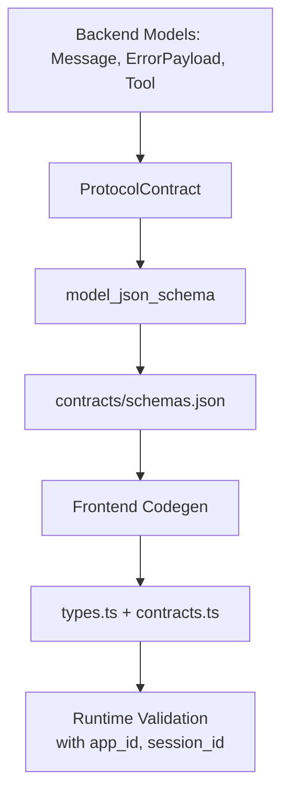
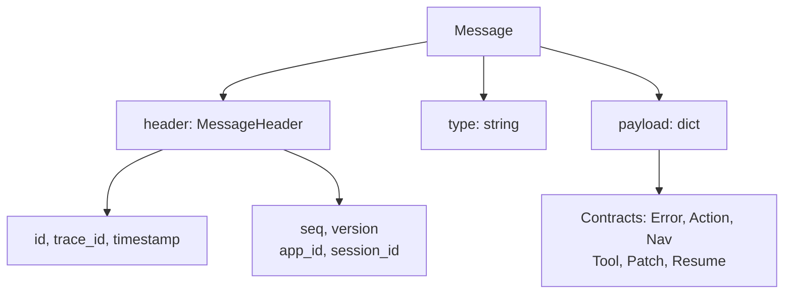

# Protocol Schema & Codegen

## Summary
Exports a JSON Schema for the protocol models (message, page, agent event, error, action, navigation, style/theme, state patch, tool, nodes, resume) to `contracts/schemas.json` via a backend script. [agentprinter-fastapi/scripts/export_schema.py:L18-L41](agentprinter-fastapi/scripts/export_schema.py#L18-L41)
The message header carries identity, auth context, and monotonic sequencing (`seq`) for ordering. Error, Action, Navigation, Style/Theme, Tool, and Resume payloads are structured with explicit contracts for safe, extensible protocol design. [agentprinter-fastapi/src/agentprinter_fastapi/schemas/](agentprinter-fastapi/src/agentprinter_fastapi/schemas/)
Front-end code generation consumes that schema to produce TypeScript types and Zod validators for all contract types. [agentprinter-react/package.json:L21-L22](agentprinter-react/package.json#L21-L22)

## Where to Start in Code
Fast entry points for future readers (no speculation; evidence-backed):
- **Primary entrypoint(s)**: [agentprinter-fastapi/scripts/export_schema.py:L43-L69](agentprinter-fastapi/scripts/export_schema.py#L43-L69)
- **Key orchestrator/service**: [agentprinter-fastapi/scripts/export_schema.py:L24-L41](agentprinter-fastapi/scripts/export_schema.py#L24-L41)
- **Message header definition (with seq)**: [agentprinter-fastapi/src/agentprinter_fastapi/schemas/protocol.py:L22-L32](agentprinter-fastapi/src/agentprinter_fastapi/schemas/protocol.py#L22-L32)
- **Resume payload definition**: [agentprinter-fastapi/src/agentprinter_fastapi/schemas/protocol.py:L18-L20](agentprinter-fastapi/src/agentprinter_fastapi/schemas/protocol.py#L18-L20)
- **Error payload definition**: [agentprinter-fastapi/src/agentprinter_fastapi/schemas/protocol.py:L6-L10](agentprinter-fastapi/src/agentprinter_fastapi/schemas/protocol.py#L6-L10)
- **Navigation definition**: [agentprinter-fastapi/src/agentprinter_fastapi/schemas/protocol.py:L12-L17](agentprinter-fastapi/src/agentprinter_fastapi/schemas/protocol.py#L12-L17)
- **Action definition**: [agentprinter-fastapi/src/agentprinter_fastapi/schemas/actions.py:L4-L11](agentprinter-fastapi/src/agentprinter_fastapi/schemas/actions.py#L4-L11)
- **Theme tokens definition**: [agentprinter-fastapi/src/agentprinter_fastapi/schemas/ui.py:L4-L14](agentprinter-fastapi/src/agentprinter_fastapi/schemas/ui.py#L4-L14)
- **Component style definition**: [agentprinter-fastapi/src/agentprinter_fastapi/schemas/ui.py:L15-L21](agentprinter-fastapi/src/agentprinter_fastapi/schemas/ui.py#L15-L21)
- **Tool & Schema contract definitions**: [agentprinter-fastapi/src/agentprinter_fastapi/schemas/tools.py:L4-L18](agentprinter-fastapi/src/agentprinter_fastapi/schemas/tools.py#L4-L18)
- **Data layer / schema** (if applicable): [agentprinter-react/src/contracts.ts:L157-L246](agentprinter-react/src/contracts.ts#L157-L246)

## Users & Triggers
- Backend developers run the export script to generate `contracts/schemas.json`. [agentprinter-fastapi/scripts/export_schema.py:L43-L69](agentprinter-fastapi/scripts/export_schema.py#L43-L69)
- Frontend developers run the `codegen` script to transform schemas into types and Zod validators. [agentprinter-react/package.json:L21-L22](agentprinter-react/package.json#L21-L22)
- The runtime validates incoming messages using `messageSchema`. [agentprinter-react/src/provider.tsx:L62-L69](agentprinter-react/src/provider.tsx#L62-L69)

## What Happens
- The backend composes a `ProtocolContract` that references all protocol models. [agentprinter-fastapi/scripts/export_schema.py:L24-L41](agentprinter-fastapi/scripts/export_schema.py#L24-L41)
- `model_json_schema()` is called and written to `contracts/schemas.json`. [agentprinter-fastapi/scripts/export_schema.py:L45-L64](agentprinter-fastapi/scripts/export_schema.py#L45-L64)
- Frontend `codegen` uses `json2ts` and `ts-to-zod` to create `types.ts` and `contracts.ts`. [agentprinter-react/package.json:L21-L22](agentprinter-react/package.json#L21-L22)
- Runtime validation uses the generated `messageSchema` and `componentNodeSchema`. [agentprinter-react/src/provider.tsx:L62-L69](agentprinter-react/src/provider.tsx#L62-L69), [agentprinter-react/src/runtime.tsx:L11-L23](agentprinter-react/src/runtime.tsx#L11-L23)

## Rules & Constraints
- The protocol contract includes `message`, `page`, `event`, `error`, `action`, `navigation`, `style`, `theme`, `tool`, `schema_contract`, `patch`, `nodes`, and `resume` fields. [agentprinter-fastapi/scripts/export_schema.py:L29-L41](agentprinter-fastapi/scripts/export_schema.py#L29-L41)
- `MessageHeader` includes optional `seq` (int) for ordering, plus identity fields: `app_id`, `session_id`, `workspace_id`, `user_id`. [agentprinter-fastapi/src/agentprinter_fastapi/schemas/protocol.py:L22-L32](agentprinter-fastapi/src/agentprinter_fastapi/schemas/protocol.py#L22-L32)
- `ResumePayload` defines `last_seen_seq` for connection recovery. [agentprinter-fastapi/src/agentprinter_fastapi/schemas/protocol.py:L18-L20](agentprinter-fastapi/src/agentprinter_fastapi/schemas/protocol.py#L18-L20)
- `ErrorPayload` is a structured error response with `code`, `message`, and `details` dict. [agentprinter-fastapi/src/agentprinter_fastapi/schemas/protocol.py:L6-L10](agentprinter-fastapi/src/agentprinter_fastapi/schemas/protocol.py#L6-L10)
- `Navigation` defines routing with `to`, `params`, `replace`, and `open` fields. [agentprinter-fastapi/src/agentprinter_fastapi/schemas/protocol.py:L12-L17](agentprinter-fastapi/src/agentprinter_fastapi/schemas/protocol.py#L12-L17)
- `ActionPayload` defines user actions with `action_id`, `trigger`, `target`, `mode`, and `payload_mapping`. [agentprinter-fastapi/src/agentprinter_fastapi/schemas/actions.py:L4-L11](agentprinter-fastapi/src/agentprinter_fastapi/schemas/actions.py#L4-L11)
- `ThemeTokens` provides design tokens for colors, spacing, typography, and radius. [agentprinter-fastapi/src/agentprinter_fastapi/schemas/ui.py:L4-L14](agentprinter-fastapi/src/agentprinter_fastapi/schemas/ui.py#L4-L14)
- `ComponentStyle` allows safe styling with theme tokens, allowlisted classes, and bounded inline styles. [agentprinter-fastapi/src/agentprinter_fastapi/schemas/ui.py:L15-L21](agentprinter-fastapi/src/agentprinter_fastapi/schemas/ui.py#L15-L21)
- `ComponentNode` includes optional `style` field for appearance control. [agentprinter-fastapi/src/agentprinter_fastapi/schemas/ui.py:L28-L35](agentprinter-fastapi/src/agentprinter_fastapi/schemas/ui.py#L28-L35)
- `Tool` metadata defines tool panels with `input_schema` and `ui_schema`. [agentprinter-fastapi/src/agentprinter_fastapi/schemas/tools.py:L4-L11](agentprinter-fastapi/src/agentprinter_fastapi/schemas/tools.py#L4-L11)
- `messageSchema` requires `type`, `header`, and `payload` fields. [agentprinter-react/src/contracts.ts:L157-L161](agentprinter-react/src/contracts.ts#L157-L161)
- `componentNodeSchema` requires `id` and `type`, with optional props, bindings, style, and children. [agentprinter-react/src/contracts.ts:L215-L223](agentprinter-react/src/contracts.ts#L215-L223)

## Edge Cases & Failure Outcomes
- The export script overwrites `contracts/schemas.json` on each run. [agentprinter-fastapi/scripts/export_schema.py:L63-L64](agentprinter-fastapi/scripts/export_schema.py#L63-L64)

## Use Cases
- **Use case**: Export protocol schema to `contracts/schemas.json`
  - **Trigger**: Developer runs the export script
  - **Outcome**: JSON Schema file is generated in `contracts/`
  - **Evidence**: [agentprinter-fastapi/scripts/export_schema.py:L43-L64](agentprinter-fastapi/scripts/export_schema.py#L43-L64)
- **Use case**: Generate frontend contracts from schema
  - **Trigger**: Developer runs `bun run codegen`
  - **Outcome**: TypeScript and Zod definitions are produced
  - **Evidence**: [agentprinter-react/package.json:L21-L22](agentprinter-react/package.json#L21-L22)
- **Use case**: Validate incoming messages at runtime
  - **Trigger**: WebSocket message arrives in the provider
  - **Outcome**: Messages are validated against `messageSchema`
  - **Evidence**: [agentprinter-react/src/provider.tsx:L62-L69](agentprinter-react/src/provider.tsx#L62-L69)
- **Use case**: Identify requests with app_id and session_id
  - **Trigger**: Message header is created or received
  - **Outcome**: Apps can track sessions and multi-tenant contexts
  - **Evidence**: [agentprinter-fastapi/src/agentprinter_fastapi/schemas/protocol.py:L24-L27](agentprinter-fastapi/src/agentprinter_fastapi/schemas/protocol.py#L24-L27)
- **Use case**: Handle and propagate structured errors
  - **Trigger**: An error occurs in a backend handler or action
  - **Outcome**: Structured error with code and details is sent via `protocol.error` message
  - **Evidence**: [agentprinter-fastapi/src/agentprinter_fastapi/schemas/protocol.py:L6-L10](agentprinter-fastapi/src/agentprinter_fastapi/schemas/protocol.py#L6-L10)
- **Use case**: Validate and execute navigation
  - **Trigger**: Backend sends navigation instruction to frontend
  - **Outcome**: Navigation payload is validated against `navigationSchema` and route is updated
  - **Evidence**: [agentprinter-fastapi/src/agentprinter_fastapi/schemas/protocol.py:L12-L17](agentprinter-fastapi/src/agentprinter_fastapi/schemas/protocol.py#L12-L17)
- **Use case**: Control component appearance with design tokens and allowlisted styles
  - **Trigger**: Backend specifies style contract in component node
  - **Outcome**: Theme tokens, classes, and variant are applied; arbitrary CSS is blocked
  - **Evidence**: [agentprinter-fastapi/src/agentprinter_fastapi/schemas/ui.py:L4-L21](agentprinter-fastapi/src/agentprinter_fastapi/schemas/ui.py#L4-L21)
- **Use case**: Export tool metadata and form schemas
  - **Trigger**: Backend defines tools and forms in the protocol contract
  - **Outcome**: Frontend receives structured schemas for rendering tool panels and dynamic forms
  - **Evidence**: [agentprinter-fastapi/src/agentprinter_fastapi/schemas/tools.py:L4-L18](agentprinter-fastapi/src/agentprinter_fastapi/schemas/tools.py#L4-L18)
- **Use case**: Validate resume payload
  - **Trigger**: Client sends `protocol.resume`
  - **Outcome**: Backend validates `last_seen_seq` using `ResumePayload` schema
  - **Evidence**: [agentprinter-fastapi/src/agentprinter_fastapi/schemas/protocol.py:L18-L20](agentprinter-fastapi/src/agentprinter_fastapi/schemas/protocol.py#L18-L20)

## Scope Navigation
- **Parent**: [Product Scopes](../README.md)
- **Children**
  - None

## Scope Network (Cross-links)
Every relationship must include evidence, or be placed under "Possible Relations".

- **Depends on / Uses (Upstream)**
  - [Backend WebSocket Runtime](../Backend/WebSocket_Runtime.md) — protocol models are defined and exported from backend schemas. [agentprinter-fastapi/scripts/export_schema.py:L7-L22](agentprinter-fastapi/scripts/export_schema.py#L7-L22)
- **Used by / Downstream**
  - [Remote UI Runtime](../Frontend/Remote_UI_Runtime.md) — frontend codegen and validation rely on the schema. [agentprinter-react/package.json:L21-L22](agentprinter-react/package.json#L21-L22)
  - [Demo Apps (Examples)](../Examples/Demo_Apps.md) — demo constructs `Page` and `ComponentNode` instances from protocol schemas. [examples/backend_demo.py:L8-L9](examples/backend_demo.py#L8-L9)
- **Shares Data / Topics**
  - [Remote UI Runtime](../Frontend/Remote_UI_Runtime.md) — shares `messageSchema` and `componentNodeSchema` definitions. [agentprinter-react/src/contracts.ts:L157-L223](agentprinter-react/src/contracts.ts#L157-L223)
- **Possible Relations (Low Confidence)**
  - None

## Diagrams (Mermaid inline) — exactly 2

### Diagram 1: Core Flow with Identity & Errors

### Diagram 2: Message Envelope Structure

## Usage & Flow Traces
Provide at least one end-to-end trace per major path.

| Step | Layer | Evidence Link | Description |
|------|-------|---------------|-------------|
| 1 | Entry | [agentprinter-fastapi/scripts/export_schema.py:L43-L45](agentprinter-fastapi/scripts/export_schema.py#L43-L45) | Export function generates schema from ProtocolContract |
| 2 | Models | [agentprinter-fastapi/src/agentprinter_fastapi/schemas/protocol.py:L6-L32](agentprinter-fastapi/src/agentprinter_fastapi/schemas/protocol.py#L6-L32) | ErrorPayload, MessageHeader (seq), and ResumePayload defined |
| 3 | Compose | [agentprinter-fastapi/scripts/export_schema.py:L24-L41](agentprinter-fastapi/scripts/export_schema.py#L24-L41) | ProtocolContract includes error, message, page, event, tool, patch, nodes |
| 4 | Data | [agentprinter-fastapi/scripts/export_schema.py:L63-L64](agentprinter-fastapi/scripts/export_schema.py#L63-L64) | Schema JSON written to contracts/schemas.json |
| 4a | Bindings | [agentprinter-fastapi/src/agentprinter_fastapi/schemas/ui.py:L26-L45](agentprinter-fastapi/src/agentprinter_fastapi/schemas/ui.py#L26-L45) | Bindings support computed expressions (`concat`, `format`, `if`, primitives) |
| 5 | Frontend | [agentprinter-react/package.json:L21-L22](agentprinter-react/package.json#L21-L22) | Frontend codegen generates types.ts and contracts.ts |
| 6 | Runtime | [agentprinter-react/src/provider.tsx:L62-L69](agentprinter-react/src/provider.tsx#L62-L69) | Messages validated at runtime with identity fields |

## Code Evidence (Consolidated)
| Evidence Link | What it proves |
|--------------|-----------------|
| [agentprinter-fastapi/src/agentprinter_fastapi/schemas/protocol.py:L6-L10](agentprinter-fastapi/src/agentprinter_fastapi/schemas/protocol.py#L6-L10) | ErrorPayload model with code, message, details |
| [agentprinter-fastapi/src/agentprinter_fastapi/schemas/protocol.py:L22-L32](agentprinter-fastapi/src/agentprinter_fastapi/schemas/protocol.py#L22-L32) | MessageHeader with `seq` and identity fields |
| [agentprinter-fastapi/src/agentprinter_fastapi/schemas/protocol.py:L18-L20](agentprinter-fastapi/src/agentprinter_fastapi/schemas/protocol.py#L18-L20) | ResumePayload model with `last_seen_seq` |
| [agentprinter-fastapi/src/agentprinter_fastapi/schemas/tools.py:L4-L18](agentprinter-fastapi/src/agentprinter_fastapi/schemas/tools.py#L4-L18) | Tool and SchemaContract models for dynamic forms |
| [agentprinter-fastapi/scripts/export_schema.py:L24-L41](agentprinter-fastapi/scripts/export_schema.py#L24-L41) | ProtocolContract composes all models including error and tool |
| [agentprinter-fastapi/scripts/export_schema.py:L63-L64](agentprinter-fastapi/scripts/export_schema.py#L63-L64) | Schema is exported to contracts/schemas.json |
| [agentprinter-react/package.json:L21-L22](agentprinter-react/package.json#L21-L22) | Frontend codegen uses the exported schema to generate types and Zod |
| [agentprinter-react/src/contracts.ts:L157-L223](agentprinter-react/src/contracts.ts#L157-L223) | Zod schemas exist for message and component nodes |

## Deep Dives / Sub-capabilities
Merge tiny scopes here. Mini-format: Summary → Trace → Evidence.

## Confidence & Notes
- **Confidence**: High
- **Notes**: All core protocol contracts (Identity, Error, Action, Navigation, Style, Tool) implemented 2026-02-01.
