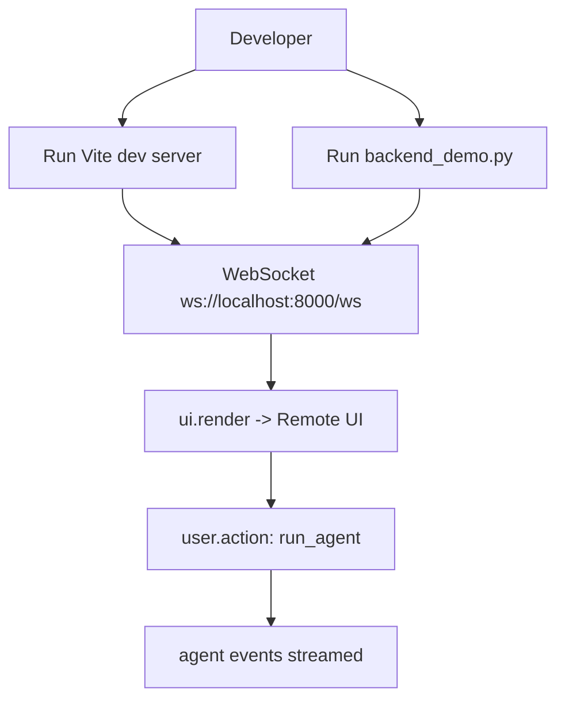

# Demo Apps (Examples)

## Summary
Provides an end-to-end demo pairing a FastAPI backend that mounts the AgentPrinter router and sets an initial `Page`, with a Vite+React frontend that renders the runtime against `ws://localhost:8000/ws`. The examples are a runnable reference for wiring the library into an app. [examples/README.md:L16-L66](examples/README.md#L16-L66)

## Where to Start in Code
- **Primary entrypoint(s)**: [examples/backend_demo.py:L1-L23](examples/backend_demo.py#L1-L23)
- **Key orchestrator/service**: [examples/backend_demo.py:L200-L226](examples/backend_demo.py#L200-L226)
- **UI surface**: [examples/frontend_demo/src/main.tsx:L1-L12](examples/frontend_demo/src/main.tsx#L1-L12)

## Users & Triggers
- A developer runs the backend demo (`uv run python backend_demo.py`) to start a FastAPI server exposing `/ws` and `/sse`. [examples/README.md:L26-L45](examples/README.md#L26-L45)
- A developer runs the frontend demo (`bun run dev`) to start a Vite dev server that mounts `AgentPrinterRuntime` pointing at the backend WebSocket URL. [examples/README.md:L51-L66](examples/README.md#L51-L66), [examples/frontend_demo/src/main.tsx:L6-L10](examples/frontend_demo/src/main.tsx#L6-L10)
- A user clicks a UI element that emits a `user.action` message via an action payload (`action_id`, `trigger`, `target`) which the backend action router handles. [examples/backend_demo.py:L264-L276](examples/backend_demo.py#L264-L276)
- A user clicks the Storybook nav button that emits `user.action` with `action_id: show_storybook` and `payload.trigger/target`. [examples/backend_demo.py:L232-L255](examples/backend_demo.py#L232-L255)
- A user clicks the Storybook header button that emits `user.action` with `action_id: show_storybook` and `payload.trigger/target`. [examples/backend_demo.py:L318-L330](examples/backend_demo.py#L318-L330)

## What Happens
- The backend demo creates a FastAPI app, includes the AgentPrinter router, defines a `Page` with a `ComponentNode` tree, and sets it as the initial page sent on connect. [examples/backend_demo.py:L11-L28](examples/backend_demo.py#L11-L28), [examples/backend_demo.py:L22-L23](examples/backend_demo.py#L22-L23), [examples/backend_demo.py:L25-L31](examples/backend_demo.py#L25-L31), [examples/backend_demo.py:L200-L201](examples/backend_demo.py#L200-L201)
- The frontend demo mounts `AgentPrinterRuntime` and connects to `ws://localhost:8000/ws` to receive `ui.render` and other protocol messages. [examples/frontend_demo/src/main.tsx:L6-L10](examples/frontend_demo/src/main.tsx#L6-L10)
- When the `run_agent` action is triggered, the backend streams a mocked agent execution into the active WebSocket via `AgentRunner.run_stream(...)`. [examples/backend_demo.py:L205-L226](examples/backend_demo.py#L205-L226)
- When the Storybook action is triggered, the backend sends a `ui.render` with the Storybook page. [examples/backend_demo.py:L575-L583](examples/backend_demo.py#L575-L583), [examples/backend_demo.py:L93-L172](examples/backend_demo.py#L93-L172)

## Rules & Constraints
- Backend demo allows CORS from the frontend dev server origins (`localhost:3000` and `127.0.0.1:3000`). [examples/backend_demo.py:L13-L20](examples/backend_demo.py#L13-L20)
- The frontend demo hardcodes the WebSocket URL to `ws://localhost:8000/ws`. [examples/frontend_demo/src/main.tsx:L9-L9](examples/frontend_demo/src/main.tsx#L9-L9)
- The backend demo resolves an agent mode via `AGENTPRINTER_DEMO_AGENT_MODE` (`mock`/`real`/`auto`) and falls back to mock when optional deps are missing. [examples/backend_demo.py:L29-L52](examples/backend_demo.py#L29-L52)
- When a real mode request falls back to mock, the streamed agent output begins with a warning token. [examples/backend_demo.py:L55-L57](examples/backend_demo.py#L55-L57)

## Edge Cases & Failure Outcomes
- If the backend is not running on port 8000, the frontend demo cannot connect to the hardcoded WebSocket URL. [examples/README.md:L94-L96](examples/README.md#L94-L96), [examples/frontend_demo/src/main.tsx:L9-L9](examples/frontend_demo/src/main.tsx#L9-L9)

## Use Cases
- **Run backend demo with `uv run`**
  - **Trigger**: Developer runs `uv run python backend_demo.py`
  - **Outcome**: FastAPI app starts, exposing `/` and AgentPrinter routes (including `/ws`)
  - **Evidence**: [examples/README.md:L26-L36](examples/README.md#L26-L36), [examples/backend_demo.py:L227-L233](examples/backend_demo.py#L227-L233)
- **Run frontend demo with Vite dev server**
  - **Trigger**: Developer runs `bun run dev`
  - **Outcome**: Vite serves a React app that mounts `AgentPrinterRuntime`
  - **Evidence**: [examples/README.md:L53-L66](examples/README.md#L53-L66), [examples/frontend_demo/package.json:L6-L9](examples/frontend_demo/package.json#L6-L9)
- **Trigger an agent run from UI**
  - **Trigger**: Client sends `user.action` from a button action payload (`action_id: run_agent`, `payload.trigger: click`, `payload.target: agent:run_agent`)
  - **Outcome**: Backend streams `start/token/tool_call/tool_result/finish` events for run id `demo-run`
  - **Evidence**: [examples/backend_demo.py:L440-L455](examples/backend_demo.py#L440-L455), [examples/backend_demo.py:L205-L226](examples/backend_demo.py#L205-L226)
- **Open Storybook from nav**
  - **Trigger**: Client sends `user.action` from Storybook button (`action_id: show_storybook`, `payload.trigger: click`, `payload.target: nav:storybook`)
  - **Outcome**: Backend sends `ui.render` for the Storybook page.
  - **Evidence**: [examples/backend_demo.py:L158-L172](examples/backend_demo.py#L158-L172), [examples/backend_demo.py:L575-L583](examples/backend_demo.py#L575-L583)
- **Open Storybook from header**
  - **Trigger**: Client sends `user.action` from Storybook header button (`action_id: show_storybook`, `payload.trigger: click`, `payload.target: nav:storybook`)
  - **Outcome**: Backend sends `ui.render` for the Storybook page.
  - **Evidence**: [examples/backend_demo.py:L317-L328](examples/backend_demo.py#L317-L328), [examples/backend_demo.py:L575-L583](examples/backend_demo.py#L575-L583)

## UI Surface

### Page Identity
- **Route / Path**: Rendered root is mounted into DOM element `"root"`. [examples/frontend_demo/src/main.tsx:L6-L6](examples/frontend_demo/src/main.tsx#L6-L6)
- **User Intent**: View and interact with the server-driven UI streamed from the backend demo.

### UI Mock (Low-fidelity, Evidence-backed)
```
+------------------------------------------+
| <div class="min-h-screen ...">           |
|   <AgentPrinterRuntime url="ws://...">   |
| </div>                                   |
| (Evidence: [examples/frontend_demo/src/main.tsx:L8-L10](examples/frontend_demo/src/main.tsx#L8-L10)) |
+------------------------------------------+
```

### Interactions & State
- **Navigation**: Not configured in the demo frontend; `AgentPrinterRuntime` is mounted directly. [examples/frontend_demo/src/main.tsx:L6-L10](examples/frontend_demo/src/main.tsx#L6-L10)
- **States**: The demo backend sets an initial page, implying an initial `ui.render` is sent on connect. [examples/backend_demo.py:L200-L201](examples/backend_demo.py#L200-L201)

### Data Binding
- **Displayed Data**: The demo backend’s `Page` tree includes content strings and className props. [examples/backend_demo.py:L25-L38](examples/backend_demo.py#L25-L38), [examples/backend_demo.py:L81-L89](examples/backend_demo.py#L81-L89)
- **Actions**: The demo button emits an action payload with `action_id`, `trigger`, and `target`; the backend registers a `run_agent` handler that streams agent events. [examples/backend_demo.py:L264-L276](examples/backend_demo.py#L264-L276), [examples/backend_demo.py:L205-L226](examples/backend_demo.py#L205-L226)
- **Actions**: The Storybook nav button emits `action_id: show_storybook` with `payload.trigger/target`. [examples/backend_demo.py:L232-L255](examples/backend_demo.py#L232-L255)
- **Actions**: The Storybook header button emits `action_id: show_storybook` with `payload.trigger/target`. [examples/backend_demo.py:L318-L330](examples/backend_demo.py#L318-L330)
- **Actions**: The Storybook action handler sends a `ui.render` with the Storybook page tree. [examples/backend_demo.py:L575-L583](examples/backend_demo.py#L575-L583), [examples/backend_demo.py:L93-L172](examples/backend_demo.py#L93-L172)

## Scope Navigation
- **Parent**: [Product Scopes](../README.md)
- **Children**
  - None

## Scope Network (Cross-links)
- **Depends on / Uses (Upstream)**
  - [Backend WebSocket Runtime](../Backend/WebSocket_Runtime.md) — demo mounts the AgentPrinter router and uses `set_initial_page(...)`. [examples/backend_demo.py:L5-L6](examples/backend_demo.py#L5-L6), [examples/backend_demo.py:L22-L23](examples/backend_demo.py#L22-L23), [examples/backend_demo.py:L200-L201](examples/backend_demo.py#L200-L201)
  - [Remote UI Runtime (React)](../Frontend/Remote_UI_Runtime.md) — demo mounts `AgentPrinterRuntime`. [examples/frontend_demo/src/main.tsx:L3-L10](examples/frontend_demo/src/main.tsx#L3-L10)
- **Used by / Downstream**
  - None
- **Shares Data / Topics**
  - [Protocol Schema & Codegen](../Contracts/Protocol_Schema.md) — demo builds a `Page` and `ComponentNode` instances defined in the protocol schemas. [examples/backend_demo.py:L8-L9](examples/backend_demo.py#L8-L9)
- **Possible Relations (Low Confidence)**
  - None

## Diagrams (Mermaid inline) — exactly 2

### Diagram 1: Demo Runtime Flow


### Diagram 2: Demo Dependencies
```mermaid
flowchart TD
  DemoBackend[examples/backend_demo.py] --> FastAPI[FastAPI app]
  DemoBackend --> AgentPrinterRouter[agentprinter_fastapi.router]
  DemoBackend --> AgentRunner[agentprinter_fastapi.agent.AgentRunner]
  DemoFrontend[examples/frontend_demo] --> AgentPrinterRuntime[@agentprinter/react]
  DemoFrontend --> Browser[Browser DOM]
```

## Usage & Flow Traces
| Step | Layer | Evidence Link | Description |
|------|-------|---------------|-------------|
| 1 | Entry | [examples/README.md:L26-L36](examples/README.md#L26-L36) | Developer runs backend demo command |
| 2 | Entry | [examples/backend_demo.py:L11-L23](examples/backend_demo.py#L11-L23) | FastAPI app created; AgentPrinter router included |
| 3 | Logic | [examples/backend_demo.py:L25-L31](examples/backend_demo.py#L25-L31) | Demo `Page` and root `ComponentNode` created |
| 4 | Output | [examples/backend_demo.py:L200-L201](examples/backend_demo.py#L200-L201) | Initial page is set for connection startup |
| 5 | Entry | [examples/frontend_demo/src/main.tsx:L6-L10](examples/frontend_demo/src/main.tsx#L6-L10) | Frontend mounts `AgentPrinterRuntime` with WS URL |
| 6 | Logic | [examples/backend_demo.py:L264-L276](examples/backend_demo.py#L264-L276) | `run_agent` action payload emitted from demo button |
| 7 | Logic | [examples/backend_demo.py:L205-L226](examples/backend_demo.py#L205-L226) | `run_agent` handler streams mocked agent events |
| 8 | Logic | [examples/backend_demo.py:L232-L255](examples/backend_demo.py#L232-L255) | Storybook nav button emits `show_storybook` action |
| 9 | Output | [examples/backend_demo.py:L575-L583](examples/backend_demo.py#L575-L583) | Storybook action handler sends `ui.render` |
| 10 | Logic | [examples/backend_demo.py:L318-L330](examples/backend_demo.py#L318-L330) | Storybook header button emits `show_storybook` action |

## Code Evidence (Consolidated)
| Evidence Link | What it proves |
|--------------|-----------------|
| [examples/README.md:L26-L45](examples/README.md#L26-L45) | Commands to run backend demo (python/uvicorn) and WS URL |
| [examples/backend_demo.py:L22-L23](examples/backend_demo.py#L22-L23) | Demo app includes AgentPrinter router |
| [examples/backend_demo.py:L200-L201](examples/backend_demo.py#L200-L201) | Demo sets an initial page sent at connect |
| [examples/backend_demo.py:L264-L276](examples/backend_demo.py#L264-L276) | Demo button action payload (action_id/trigger/target) |
| [examples/backend_demo.py:L205-L226](examples/backend_demo.py#L205-L226) | Demo action handler streams agent execution |
| [examples/backend_demo.py:L232-L255](examples/backend_demo.py#L232-L255) | Storybook nav button action payload |
| [examples/backend_demo.py:L575-L583](examples/backend_demo.py#L575-L583) | Storybook action handler sends `ui.render` |
| [examples/backend_demo.py:L93-L172](examples/backend_demo.py#L93-L172) | Storybook page component tree |
| [examples/backend_demo.py:L318-L330](examples/backend_demo.py#L318-L330) | Storybook header button action payload |
| [examples/frontend_demo/src/main.tsx:L8-L10](examples/frontend_demo/src/main.tsx#L8-L10) | Demo mounts `AgentPrinterRuntime` pointed at backend WS |

## Deep Dives / Sub-capabilities
### Backend demo: Uvicorn direct run
- **Summary**: The demo README documents running the backend via `uv run uvicorn backend_demo:app --reload ...`. [examples/README.md:L38-L43](examples/README.md#L38-L43)
- **Trace**: [examples/README.md:L40-L43](examples/README.md#L40-L43) → [examples/backend_demo.py:L11-L11](examples/backend_demo.py#L11-L11)
- **Evidence**: [examples/README.md:L38-L43](examples/README.md#L38-L43)

## Confidence & Notes
- **Confidence**: High
- **Notes**: The backend package `agentprinter-fastapi/README.md` is empty, so runnable guidance is currently sourced from `examples/README.md`. [examples/README.md:L1-L3](examples/README.md#L1-L3)
