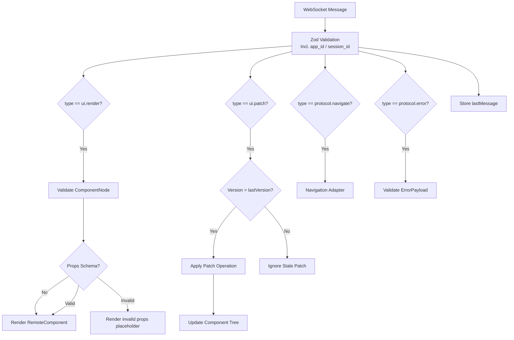
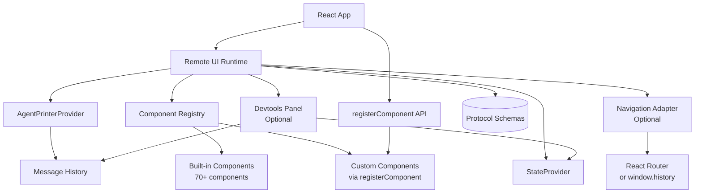

# Remote UI Runtime (React)

## Summary
Establishes a WebSocket connection, validates incoming messages with Zod (including envelope + typed payload validation for `protocol.error`), and exposes the latest valid `Message` plus a `sendMessage` API to consumers. [agentprinter-react/src/provider.tsx:L24-L93](agentprinter-react/src/provider.tsx#L24-L93), [agentprinter-react/src/provider.tsx:L176-L182](agentprinter-react/src/provider.tsx#L176-L182)
Maintains message history and provides devtools panel for inspecting events, UI tree, and state with snapshot export. [agentprinter-react/src/provider.tsx:L27-L27](agentprinter-react/src/provider.tsx#L27-L27), [agentprinter-react/src/devtools.tsx:L1-L150](agentprinter-react/src/devtools.tsx#L1-L150)
Renders server-driven UI by listening for `ui.render` messages and converting `ComponentNode` trees into React components via a registry. [agentprinter-react/src/runtime.tsx:L75-L85](agentprinter-react/src/runtime.tsx#L75-L85), [agentprinter-react/src/renderer.tsx:L1447-L1499](agentprinter-react/src/renderer.tsx#L1447-L1499)
Validates component props against registered schemas and renders a fallback placeholder on invalid props. [agentprinter-react/src/renderer.tsx:L1867-L1902](agentprinter-react/src/renderer.tsx#L1867-L1902)
Provides a built-in component bank with 60+ components across 12 families (Chat, 3D, Charts, Content, etc.) and a public `registerComponent` API for custom components. [agentprinter-react/src/renderer.tsx:L1366-L1443](agentprinter-react/src/renderer.tsx#L1366-L1443), [agentprinter-react/src/components/content.tsx:L1-L240](agentprinter-react/src/components/content.tsx#L1-L240)
Applies incremental `ui.patch` messages to update component trees with version ordering. [agentprinter-react/src/runtime.tsx:L86-L103](agentprinter-react/src/runtime.tsx#L86-L103)
Processes `protocol.navigate` messages via an optional navigation adapter for multi-page routing. [agentprinter-react/src/runtime.tsx:L104-L118](agentprinter-react/src/runtime.tsx#L104-L118)
Applies `state.patch` messages with JSON Patch operations while ignoring stale versions. [agentprinter-react/src/state.tsx:L43-L88](agentprinter-react/src/state.tsx#L43-L88)
Renders dynamic, schema-driven forms from `SchemaContract` (JSON Schema) that emit `user.action` on submission. [agentprinter-react/src/components/schema-form.tsx:L1-L120](agentprinter-react/src/components/schema-form.tsx#L1-L120)

## Where to Start in Code
Fast entry points for future readers (no speculation; evidence-backed):
- **Primary entrypoint(s)**: [agentprinter-react/src/runtime.tsx:L7-L45](agentprinter-react/src/runtime.tsx#L7-L45)
- **Key orchestrator/service**: [agentprinter-react/src/provider.tsx:L24-L190](agentprinter-react/src/provider.tsx#L24-L190)
- **Data layer / schema** (if applicable): [agentprinter-react/src/contracts.ts:L157-L223](agentprinter-react/src/contracts.ts#L157-L223)

## Users & Triggers
- React apps mount `AgentPrinterRuntime` with a WebSocket URL to start the runtime. [agentprinter-react/src/runtime.tsx:L120-L124](agentprinter-react/src/runtime.tsx#L120-L124)
- Server messages of type `ui.render` update the root component tree. [agentprinter-react/src/runtime.tsx:L75-L85](agentprinter-react/src/runtime.tsx#L75-L85)
- Server messages of type `ui.patch` incrementally update component props or children. [agentprinter-react/src/runtime.tsx:L86-L103](agentprinter-react/src/runtime.tsx#L86-L103)
- Server messages of type `protocol.navigate` trigger route changes via navigation adapter. [agentprinter-react/src/runtime.tsx:L104-L118](agentprinter-react/src/runtime.tsx#L104-L118)
- User interactions in rendered components emit `user.action` messages back to the server using `buildActionMessage` helper. [agentprinter-react/src/renderer.tsx:L245-L251](agentprinter-react/src/renderer.tsx#L245-L251)
- `state.patch` messages update local state with version ordering. [agentprinter-react/src/state.tsx:L43-L88](agentprinter-react/src/state.tsx#L43-L88)

## What Happens
- The provider opens a WebSocket, parses incoming JSON, validates the envelope, then validates typed payloads for known message types (currently `protocol.error`). Invalid typed payloads are warned and dropped. [agentprinter-react/src/provider.tsx:L31-L93](agentprinter-react/src/provider.tsx#L31-L93), [agentprinter-react/src/contracts.ts:L109-L118](agentprinter-react/src/contracts.ts#L109-L118)
- The runtime listens for `ui.render`, validates the root node, and renders a `RemoteComponent` tree. [agentprinter-react/src/runtime.tsx:L75-L85](agentprinter-react/src/runtime.tsx#L75-L85)
- The runtime listens for `ui.patch`, applies patch operations (update_props, update_children, add, remove) to the component tree, and ignores stale versions. [agentprinter-react/src/runtime.tsx:L86-L103](agentprinter-react/src/runtime.tsx#L86-L103)
- The runtime listens for `protocol.navigate` and calls the navigation adapter (or uses window.history if no adapter provided). [agentprinter-react/src/runtime.tsx:L104-L118](agentprinter-react/src/runtime.tsx#L104-L118)
- If the server sends a `protocol.error` message, its payload is validated against `errorPayloadSchema` and dropped if invalid. [agentprinter-react/src/provider.tsx:L31-L42](agentprinter-react/src/provider.tsx#L31-L42), [agentprinter-react/src/contracts.ts:L169-L173](agentprinter-react/src/contracts.ts#L169-L173)
- The renderer resolves component types from a registry (built-in components or custom registered components), applies bindings from state, filters styles against an allowlist, and renders recursively. [agentprinter-react/src/renderer.tsx:L1447-L1499](agentprinter-react/src/renderer.tsx#L1447-L1499)
- Custom components can be registered via `registerComponent` API, allowing teams to extend or override the built-in component bank. [agentprinter-react/src/renderer.tsx:L1445-L1465](agentprinter-react/src/renderer.tsx#L1445-L1465)
- Inline styles are filtered against a CSS property allowlist before rendering, blocking unsafe properties (e.g., `behavior`, `expression`) and unsafe values (e.g., `javascript:`, `eval()`). [agentprinter-react/src/renderer.tsx:L18-L75](agentprinter-react/src/renderer.tsx#L18-L75)
- Optional devtools panel (`AgentPrinterDevtools`) provides inspection of message history, UI tree, and state, with snapshot export for bug reports. [agentprinter-react/src/devtools.tsx:L1-L150](agentprinter-react/src/devtools.tsx#L1-L150)
- Interactive components package `user.action` envelopes via `buildActionMessage` (ensuring `target` is forwarded) and send them via the provider. [agentprinter-react/src/renderer.tsx:L245-L251](agentprinter-react/src/renderer.tsx#L245-L251), [agentprinter-react/src/utils.ts:L32-L55](agentprinter-react/src/utils.ts#L32-L55)

## Rules & Constraints
- Messages are only accepted when they pass `messageSchema` envelope validation. [agentprinter-react/src/provider.tsx:L80-L89](agentprinter-react/src/provider.tsx#L80-L89)
- `protocol.error` messages are only accepted when their payload passes `errorPayloadSchema`; invalid error payloads are warned and dropped. [agentprinter-react/src/provider.tsx:L31-L42](agentprinter-react/src/provider.tsx#L31-L42)
- The runtime only updates UI for `ui.render` messages with a valid `ComponentNode` root. [agentprinter-react/src/runtime.tsx:L75-L85](agentprinter-react/src/runtime.tsx#L75-L85)
- `ui.patch` updates with versions less than or equal to the last version are ignored. [agentprinter-react/src/runtime.tsx:L88-L94](agentprinter-react/src/runtime.tsx#L88-L94)
- `ui.patch` operations that target non-existent component IDs log a warning and are ignored. [agentprinter-react/src/runtime.tsx:L34-L38](agentprinter-react/src/runtime.tsx#L34-L38)
- Unknown component types render an error placeholder rather than crashing. [agentprinter-react/src/renderer.tsx:L1454-L1475](agentprinter-react/src/renderer.tsx#L1454-L1475)
- `state.patch` updates with versions less than or equal to the last version are ignored. [agentprinter-react/src/state.tsx:L56-L61](agentprinter-react/src/state.tsx#L56-L61)
- `sendMessage` only sends when the socket is open. [agentprinter-react/src/provider.tsx:L176-L182](agentprinter-react/src/provider.tsx#L176-L182)
- Navigation adapter is optional; if not provided, `protocol.navigate` uses `window.history`. [agentprinter-react/src/runtime.tsx:L104-L118](agentprinter-react/src/runtime.tsx#L104-L118)
- Components can be registered or overridden via `registerComponent` API. [agentprinter-react/src/renderer.tsx:L1445-L1465](agentprinter-react/src/renderer.tsx#L1445-L1465)
- Inline styles are filtered against an allowlist; disallowed CSS properties and unsafe values are stripped with a warning. [agentprinter-react/src/renderer.tsx:L18-L75](agentprinter-react/src/renderer.tsx#L18-L75), [agentprinter-react/src/renderer.tsx:L1527-L1529](agentprinter-react/src/renderer.tsx#L1527-L1529)
- If a registered component includes a `propsSchema`, invalid props are warned and rendered with a fallback placeholder. [agentprinter-react/src/renderer.tsx:L1867-L1902](agentprinter-react/src/renderer.tsx#L1867-L1902)

## Edge Cases & Failure Outcomes
- Invalid or unparsable messages are logged and ignored. [agentprinter-react/src/provider.tsx:L77-L92](agentprinter-react/src/provider.tsx#L77-L92)
- Invalid `protocol.error` payloads are warned and dropped. [agentprinter-react/src/provider.tsx:L31-L42](agentprinter-react/src/provider.tsx#L31-L42)
- Unexpected WebSocket closures trigger a reconnect attempt with exponential backoff (1s, 2s, 4s, ..., capped at 30s). [agentprinter-react/src/provider.tsx:L104-L125](agentprinter-react/src/provider.tsx#L104-L125)
- On reconnect, the provider sends a `protocol.resume` message with `last_seen_version` for best-effort resume. [agentprinter-react/src/provider.tsx:L62-L82](agentprinter-react/src/provider.tsx#L62-L82)
- Invalid `ui.render` roots log a warning and are not rendered. [agentprinter-react/src/runtime.tsx:L78-L84](agentprinter-react/src/runtime.tsx#L78-L84)
- Unknown component types render a fallback placeholder. [agentprinter-react/src/renderer.tsx:L1454-L1475](agentprinter-react/src/renderer.tsx#L1454-L1475)
- Stale `ui.patch` versions are ignored with a warning. [agentprinter-react/src/runtime.tsx:L91-L93](agentprinter-react/src/runtime.tsx#L91-L93)
- `ui.patch` operations targeting non-existent component IDs are ignored with a warning. [agentprinter-react/src/runtime.tsx:L34-L38](agentprinter-react/src/runtime.tsx#L34-L38)
- Unknown `ui.patch` operations log a warning and are ignored. [agentprinter-react/src/runtime.tsx:L64-L66](agentprinter-react/src/runtime.tsx#L64-L66)
- Disallowed CSS properties in inline styles are stripped with a warning. [agentprinter-react/src/renderer.tsx:L18-L75](agentprinter-react/src/renderer.tsx#L18-L75)
- Unsafe CSS values (e.g., `javascript:`, `eval()`) are blocked with a warning. [agentprinter-react/src/renderer.tsx:L18-L75](agentprinter-react/src/renderer.tsx#L18-L75)
- Stale `state.patch` versions are ignored. [agentprinter-react/src/state.tsx:L56-L61](agentprinter-react/src/state.tsx#L56-L61)

## Use Cases
- **Use case**: Provider connects on mount
  - **Trigger**: `AgentPrinterProvider` is mounted with a URL
  - **Outcome**: WebSocket connects and the provider reports "Connected"
  - **Evidence**: [agentprinter-react/tests/provider.test.tsx:L31-L50](agentprinter-react/tests/provider.test.tsx#L31-L50)
- **Use case**: Validate identity fields in message header
  - **Trigger**: Server sends a message with `app_id` and `session_id`
  - **Outcome**: Zod validation succeeds for the header
  - **Evidence**: [agentprinter-react/src/contracts.ts:L109-L118](agentprinter-react/src/contracts.ts#L109-L118)
- **Use case**: Render UI after `ui.render`
  - **Trigger**: Server sends a `ui.render` message
  - **Outcome**: Runtime renders text content from the component tree
  - **Evidence**: [agentprinter-react/tests/runtime.test.tsx:L20-L55](agentprinter-react/tests/runtime.test.tsx#L20-L55)
- **Use case**: Button click emits `user.action`
  - **Trigger**: User clicks a rendered `button` with an `action`
  - **Outcome**: `user.action` payload is sent over the socket
  - **Evidence**: [agentprinter-react/tests/interactive.test.tsx:L15-L71](agentprinter-react/tests/interactive.test.tsx#L15-L71)
- **Use case**: Receive structured `protocol.error`
  - **Trigger**: Server sends an error message
  - **Outcome**: Payload is validated against `errorPayloadSchema`; invalid payloads are warned and dropped
  - **Evidence**: [agentprinter-react/src/provider.tsx:L31-L42](agentprinter-react/src/provider.tsx#L31-L42), [agentprinter-react/tests/provider.test.tsx:L87-L160](agentprinter-react/tests/provider.test.tsx#L87-L160)
- **Use case**: Apply `ui.patch` to update component props
  - **Trigger**: Server sends a `ui.patch` message with `update_props` operation
  - **Outcome**: Component tree is updated with new props; component re-renders with updated props
  - **Evidence**: [agentprinter-react/src/runtime.tsx:L86-L103](agentprinter-react/src/runtime.tsx#L86-L103), [agentprinter-react/tests/ui-patch-nav.test.tsx:L18-L86](agentprinter-react/tests/ui-patch-nav.test.tsx#L18-L86)
- **Use case**: Ignore stale `ui.patch` messages
  - **Trigger**: Server sends a `ui.patch` message with version <= last seen version
  - **Outcome**: Patch is ignored with a warning; component tree remains unchanged
  - **Evidence**: [agentprinter-react/src/runtime.tsx:L88-L94](agentprinter-react/src/runtime.tsx#L88-L94), [agentprinter-react/tests/ui-patch-nav.test.tsx:L102-L150](agentprinter-react/tests/ui-patch-nav.test.tsx#L102-L150)
- **Use case**: Navigate via `protocol.navigate` message
  - **Trigger**: Server sends a `protocol.navigate` message
  - **Outcome**: Navigation adapter is called with route and options; if no adapter provided, `window.history` is used
  - **Evidence**: [agentprinter-react/src/runtime.tsx:L104-L118](agentprinter-react/src/runtime.tsx#L104-L118), [agentprinter-react/tests/ui-patch-nav.test.tsx:L44-L100](agentprinter-react/tests/ui-patch-nav.test.tsx#L44-L100)
- **Use case**: Register custom component
  - **Trigger**: Application calls `registerComponent(name, component)`
  - **Outcome**: Custom component is added to registry and can be rendered via `ComponentNode` with matching type
  - **Evidence**: [agentprinter-react/src/renderer.tsx:L1445-L1465](agentprinter-react/src/renderer.tsx#L1445-L1465), [agentprinter-react/tests/component-registry.test.tsx:L18-L42](agentprinter-react/tests/component-registry.test.tsx#L18-L42)
- **Use case**: Override built-in component
  - **Trigger**: Application calls `registerComponent` with name matching a built-in component
  - **Outcome**: Built-in component is replaced; new implementation is used for all subsequent renders
  - **Evidence**: [agentprinter-react/src/renderer.tsx:L1445-L1465](agentprinter-react/src/renderer.tsx#L1445-L1465), [agentprinter-react/tests/component-registry.test.tsx:L70-L95](agentprinter-react/tests/component-registry.test.tsx#L70-L95)
- **Use case**: Invalid props trigger validation warning and fallback
  - **Trigger**: Component is registered with `propsSchema` and receives invalid props
  - **Outcome**: Warning is logged and placeholder is rendered instead of invalid component
  - **Evidence**: [agentprinter-react/src/renderer.tsx:L1867-L1902](agentprinter-react/src/renderer.tsx#L1867-L1902), [agentprinter-react/tests/style-validation.test.tsx:L44-L83](agentprinter-react/tests/style-validation.test.tsx#L44-L83)
- **Use case**: Safe style rendering with allowlist
  - **Trigger**: Component node includes inline styles with mixed safe/unsafe properties
  - **Outcome**: Safe CSS properties are rendered; unsafe properties (e.g., `behavior`, `expression`) and unsafe values are stripped with warnings
  - **Evidence**: [agentprinter-react/src/renderer.tsx:L18-L75](agentprinter-react/src/renderer.tsx#L18-L75), [agentprinter-react/src/renderer.tsx:L1527-L1529](agentprinter-react/src/renderer.tsx#L1527-L1529), [agentprinter-react/tests/style-validation.test.tsx:L10-L35](agentprinter-react/tests/style-validation.test.tsx#L10-L35)
- **Use case**: Evaluate computed bindings
  - **Trigger**: Component render with computed bindings (concat, format, if)
  - **Outcome**: Props are populated with dynamically evaluated string or conditional values
  - **Evidence**: [agentprinter-react/src/renderer.tsx:L1892-L1910](agentprinter-react/src/renderer.tsx#L1892-L1910), [agentprinter-react/tests/bindings.test.tsx:L72-L177](agentprinter-react/tests/bindings.test.tsx#L72-L177)
- **Use case**: Exponential backoff on reconnect
  - **Trigger**: WebSocket connection fails unexpectedly
  - **Outcome**: Reconnect attempts use exponential backoff (1s, 2s, 4s, ..., capped at 30s); attempt counter resets on successful connection
  - **Evidence**: [agentprinter-react/src/provider.tsx:L104-L125](agentprinter-react/src/provider.tsx#L104-L125), [agentprinter-react/tests/transport-backoff.test.tsx:L12-L60](agentprinter-react/tests/transport-backoff.test.tsx#L12-L60)
- **Use case**: Resume with last seen sequence
  - **Trigger**: Provider reconnects after receiving messages with sequence numbers
  - **Outcome**: On reconnect, provider sends `protocol.resume` message with `last_seen_seq` for best-effort resume
  - **Evidence**: [agentprinter-react/src/provider.tsx:L62-L82](agentprinter-react/src/provider.tsx#L62-L82), [agentprinter-react/src/provider.tsx:L84-L95](agentprinter-react/src/provider.tsx#L84-L95), [agentprinter-react/tests/transport-backoff.test.tsx:L62-L110](agentprinter-react/tests/transport-backoff.test.tsx#L62-L110)
- **Use case**: Devtools panel inspection
  - **Trigger**: Application renders `AgentPrinterDevtools` component
  - **Outcome**: Devtools panel displays message history, UI tree, and state; snapshot export copies JSON blob to clipboard
  - **Evidence**: [agentprinter-react/src/devtools.tsx:L1-L150](agentprinter-react/src/devtools.tsx#L1-L150), [agentprinter-react/tests/devtools.test.tsx:L12-L70](agentprinter-react/tests/devtools.test.tsx#L12-L70)
- **Use case**: Render schema-driven form
  - **Trigger**: Server sends `ui.render` with `schema_form` type and `schema_contract` prop
  - **Outcome**: Component renders inputs based on JSON Schema (string, number, boolean, enum) and emits `user.action` on submit
  - **Evidence**: [agentprinter-react/src/components/schema-form.tsx:L1-L120](agentprinter-react/src/components/schema-form.tsx#L1-L120), [agentprinter-react/tests/schema-form.test.tsx:L15-L82](agentprinter-react/tests/schema-form.test.tsx#L15-L82)

## Scope Navigation
- **Parent**: [Product Scopes](../README.md)
- **Children**
  - None

## Scope Network (Cross-links)
Every relationship must include evidence, or be placed under “Possible Relations”.

- **Depends on / Uses (Upstream)**
  - [Backend WebSocket Runtime](../Backend/WebSocket_Runtime.md) — expects server-side `ui.render` messages to drive UI updates. [agentprinter-react/src/runtime.tsx:L11-L23](agentprinter-react/src/runtime.tsx#L11-L23)
  - [Protocol Schema](../Contracts/Protocol_Schema.md) — validates messages against generated Zod schemas. [agentprinter-react/src/provider.tsx:L80-L89](agentprinter-react/src/provider.tsx#L80-L89)
- **Used by / Downstream**
  - [Demo Apps (Examples)](../Examples/Demo_Apps.md) — demo mounts `AgentPrinterRuntime` pointing at `ws://localhost:8000/ws`. [examples/frontend_demo/src/main.tsx:L3-L10](examples/frontend_demo/src/main.tsx#L3-L10)
- **Shares Data / Topics**
  - [Protocol Schema](../Contracts/Protocol_Schema.md) — consumes the `Message` envelope and `ComponentNode` schema. [agentprinter-react/src/contracts.ts:L157-L223](agentprinter-react/src/contracts.ts#L157-L223)
- **Possible Relations (Low Confidence)**
  - None

## Diagrams (Mermaid inline) — exactly 2

### Diagram 1: Core Flow with Identity & Errors

### Diagram 2: Ecosystem / Dependencies

## Usage & Flow Traces
Provide at least one end-to-end trace per major path.

| Step | Layer | Evidence Link | Description |
|------|-------|---------------|-------------|
| 1 | Entry | [agentprinter-react/src/provider.tsx:L72-L80](agentprinter-react/src/provider.tsx#L72-L80) | WebSocket receives a message and parses JSON |
| 2 | Validation | [agentprinter-react/src/provider.tsx:L80-L86](agentprinter-react/src/provider.tsx#L80-L86) | Message is validated by `messageSchema`, then typed payload is validated for known types |
| 2a | Resume | [agentprinter-react/src/provider.tsx:L62-L82](agentprinter-react/src/provider.tsx#L62-L82) | On reconnect, `protocol.resume` message sent with `last_seen_seq` |
| 2b | Seq Tracking | [agentprinter-react/src/provider.tsx:L84-L95](agentprinter-react/src/provider.tsx#L84-L95) | Message header sequence (seq) tracked for resume capability |
| 3 | Logic | [agentprinter-react/src/runtime.tsx:L75-L85](agentprinter-react/src/runtime.tsx#L75-L85) | `ui.render` payload drives root update |
| 4 | Logic | [agentprinter-react/src/runtime.tsx:L86-L103](agentprinter-react/src/runtime.tsx#L86-L103) | `ui.patch` payload applies patch operations with `seq` ordering check |
| 5 | Logic | [agentprinter-react/src/runtime.tsx:L104-L118](agentprinter-react/src/runtime.tsx#L104-L118) | `protocol.navigate` payload triggers navigation adapter |
| 6 | Data | [agentprinter-react/src/renderer.tsx:L1447-L1499](agentprinter-react/src/renderer.tsx#L1447-L1499) | Component registry resolves component by type (built-in or custom) |
| 6a | Validation | [agentprinter-react/src/renderer.tsx:L1867-L1902](agentprinter-react/src/renderer.tsx#L1867-L1902) | Registered component props are validated and fall back on invalid props |
| 7 | Validation | [agentprinter-react/src/renderer.tsx:L1527-L1529](agentprinter-react/src/renderer.tsx#L1527-L1529) | Inline styles are filtered against CSS property allowlist |
| 8 | Data | [agentprinter-react/src/renderer.tsx:L1445-L1465](agentprinter-react/src/renderer.tsx#L1445-L1465) | Custom components can be registered via `registerComponent` API |
| 9 | Output | [agentprinter-react/src/runtime.tsx:L110-L110](agentprinter-react/src/runtime.tsx#L110-L110) | The rendered `RemoteComponent` is returned |
| 10 | Logic | [agentprinter-react/src/components/schema-form.tsx:L19-L38](agentprinter-react/src/components/schema-form.tsx#L19-L38) | Schema-driven form collects values and emits `user.action` on submit |

## Code Evidence (Consolidated)
| Evidence Link | What it proves |
|--------------|-----------------|
| [agentprinter-react/src/provider.tsx:L24-L93](agentprinter-react/src/provider.tsx#L24-L93) | WebSocket connection lifecycle, envelope validation, and typed payload validation |
| [agentprinter-react/src/contracts.ts:L109-L118](agentprinter-react/src/contracts.ts#L109-L118) | Zod validation for identity headers in message envelope |
| [agentprinter-react/src/contracts.ts:L169-L173](agentprinter-react/src/contracts.ts#L169-L173) | Zod schema exists for structured error payloads |
| [agentprinter-react/tests/provider.test.tsx:L87-L160](agentprinter-react/tests/provider.test.tsx#L87-L160) | Provider accepts valid `protocol.error` and drops invalid error payloads |
| [agentprinter-react/src/runtime.tsx:L75-L85](agentprinter-react/src/runtime.tsx#L75-L85) | `ui.render` messages update the rendered component tree |
| [agentprinter-react/src/runtime.tsx:L86-L103](agentprinter-react/src/runtime.tsx#L86-L103) | `ui.patch` messages apply incremental updates with version ordering |
| [agentprinter-react/src/runtime.tsx:L104-L118](agentprinter-react/src/runtime.tsx#L104-L118) | `protocol.navigate` messages trigger navigation via adapter |
| [agentprinter-react/tests/ui-patch-nav.test.tsx:L18-L150](agentprinter-react/tests/ui-patch-nav.test.tsx#L18-L150) | Tests verify ui.patch updates component props and ignores stale versions |
| [agentprinter-react/src/renderer.tsx:L1447-L1499](agentprinter-react/src/renderer.tsx#L1447-L1499) | Component registry renders remote nodes recursively |
| [agentprinter-react/src/renderer.tsx:L1366-L1443](agentprinter-react/src/renderer.tsx#L1366-L1443) | Built-in component bank registration (60+ components) |
| [agentprinter-react/src/components/content.tsx:L1-L240](agentprinter-react/src/components/content.tsx#L1-L240) | Content family components (Typography, Avatar, Badge, Chip, List, Accordion) |
| [agentprinter-react/src/components/agent.tsx:L1-L118](agentprinter-react/src/components/agent.tsx#L1-L118) | Agent family components (StreamingText, AgentRunPanel, ToolCallPanel) |
| [agentprinter-react/src/renderer.tsx:L1445-L1465](agentprinter-react/src/renderer.tsx#L1445-L1465) | Public `registerComponent` API for custom component registration |
| [agentprinter-react/tests/component-registry.test.tsx:L18-L95](agentprinter-react/tests/component-registry.test.tsx#L18-L95) | Tests verify custom component registration and built-in component override |
| [agentprinter-react/src/renderer.tsx:L18-L75](agentprinter-react/src/renderer.tsx#L18-L75) | Style allowlist filtering (matches backend SAFE_CSS_PROPERTIES) |
| [agentprinter-react/src/renderer.tsx:L1527-L1529](agentprinter-react/src/renderer.tsx#L1527-L1529) | Style filtering applied before component render |
| [agentprinter-react/tests/style-validation.test.tsx:L10-L50](agentprinter-react/tests/style-validation.test.tsx#L10-L50) | Tests verify style allowlist filtering blocks unsafe properties and values |
| [agentprinter-react/src/renderer.tsx:L1867-L1902](agentprinter-react/src/renderer.tsx#L1867-L1902) | Prop validation fallback renders placeholder and warns |
| [agentprinter-react/tests/style-validation.test.tsx:L44-L83](agentprinter-react/tests/style-validation.test.tsx#L44-L83) | Tests verify invalid props warn and render fallback |
| [agentprinter-react/src/provider.tsx:L104-L125](agentprinter-react/src/provider.tsx#L104-L125) | Exponential backoff reconnect strategy (1s, 2s, 4s, ..., max 30s) |
| [agentprinter-react/src/provider.tsx:L62-L82](agentprinter-react/src/provider.tsx#L62-L82) | Resume message sent on reconnect with last_seen_version |
| [agentprinter-react/tests/transport-backoff.test.tsx:L12-L110](agentprinter-react/tests/transport-backoff.test.tsx#L12-L110) | Tests verify exponential backoff and resume message sending |
| [agentprinter-react/src/provider.tsx:L27-L27](agentprinter-react/src/provider.tsx#L27-L27) | Message history tracking (last N messages) |
| [agentprinter-react/src/devtools.tsx:L1-L150](agentprinter-react/src/devtools.tsx#L1-L150) | Devtools panel component with message/UI/state inspection and snapshot export |
| [agentprinter-react/tests/devtools.test.tsx:L12-L120](agentprinter-react/tests/devtools.test.tsx#L12-L120) | Tests verify devtools panel rendering and snapshot copy |
| [agentprinter-react/src/state.tsx:L56-L88](agentprinter-react/src/state.tsx#L56-L88) | JSON Patch state updates with version checks |
| [agentprinter-react/src/renderer.tsx:L1892-L1910](agentprinter-react/src/renderer.tsx#L1892-L1910) | Computed bindings evaluator supports `concat`, `format`, `if`, and primitives |

## Deep Dives / Sub-capabilities
Merge tiny scopes here. Mini-format: Summary → Trace → Evidence.

## Confidence & Notes
- **Confidence**: High
- **Notes**: Identity and error validation integrated into frontend contracts 2026-02-01. UI patch handling and navigation support added 2026-02-01. Component bank and registration API added 2026-02-01. Style allowlist validation added 2026-02-01. Exponential backoff and resume support (using `last_seen_seq`) added 2026-02-01. Devtools panel added 2026-02-01. Computed bindings support (`concat`, `format`, `if`) added 2026-02-01. All frontend tests passing.
